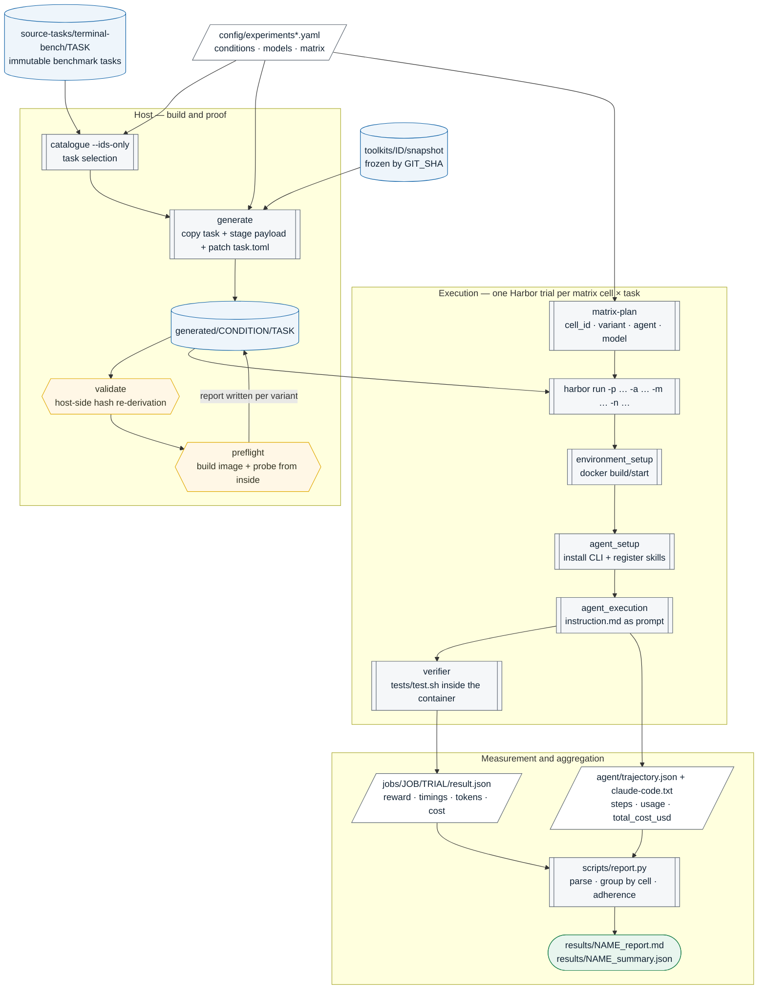
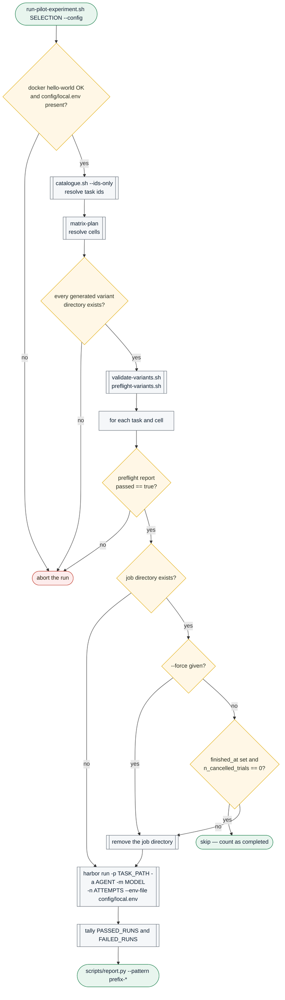
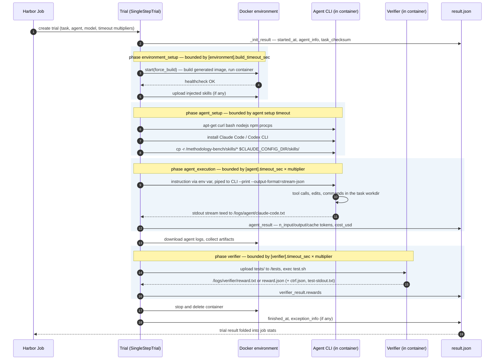
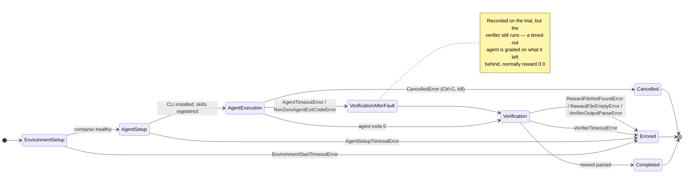
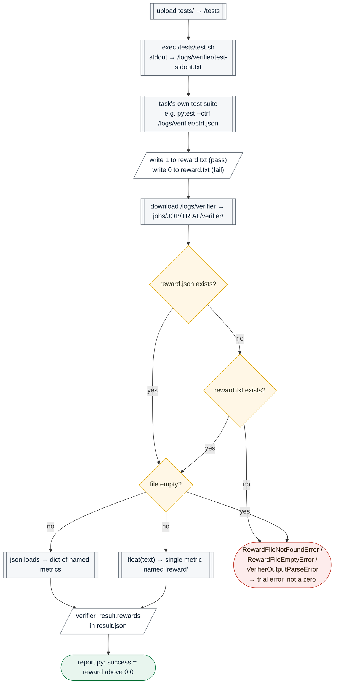
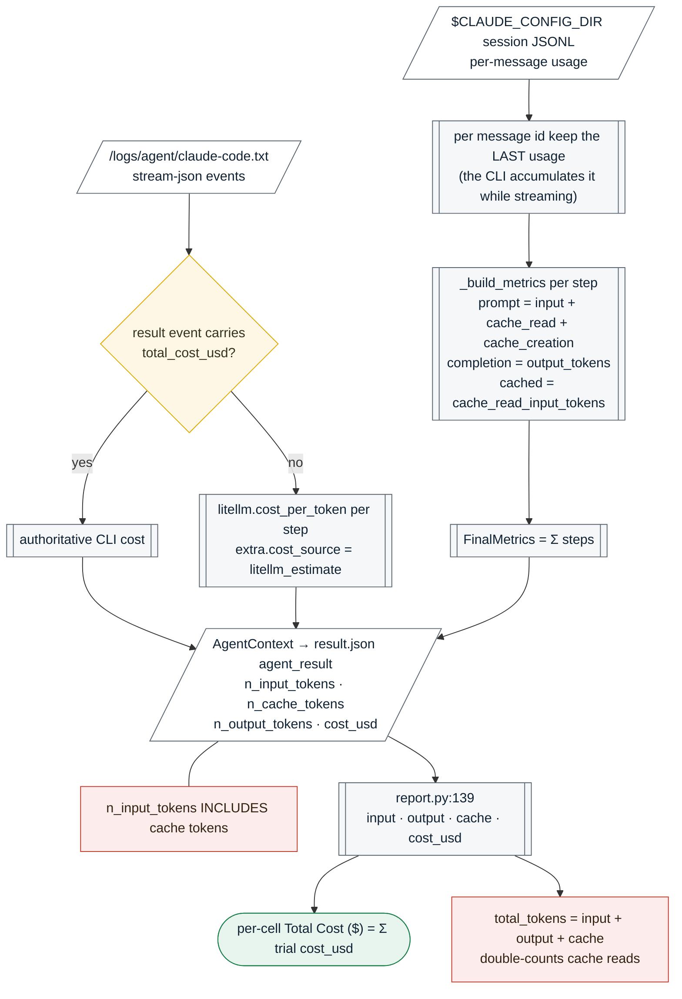
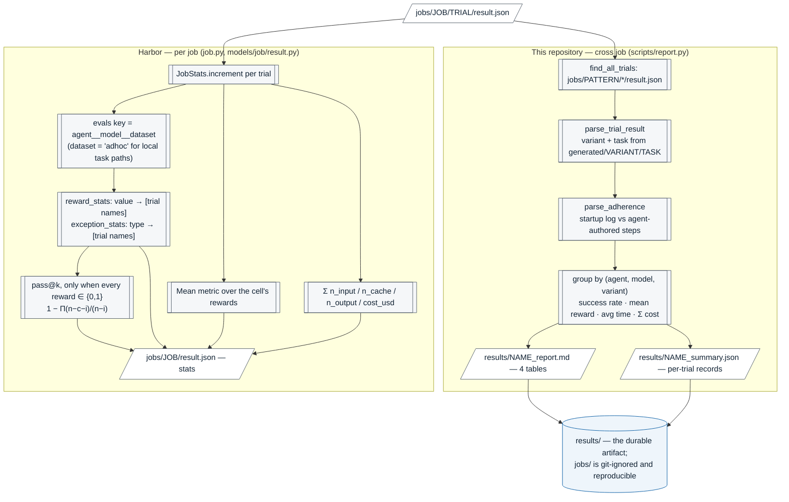

# Evaluation pipeline: from instruction to reward, duration and cost

A complete description of what happens in `harbor-methodology-bench` between the moment a task's
`instruction.md` is handed to a coding agent and the moment a number appears in
`results/<name>_report.md` — every metric, the exact code that computes it, and the ways each one can
mislead you.

> **Scope and provenance.** Two codebases are involved and this document keeps them apart. *This
> repository* owns task-variant generation, the two integrity gates, the matrix runner and the
> reporting aggregator. *Harbor* (version `0.21.0`, installed as a `uv` tool) owns the trial
> lifecycle: container start, agent installation, prompt delivery, timeouts, verifier execution,
> reward parsing, token accounting and cost attribution. All file references below are to real code;
> Harbor paths are shown relative to its package root
> (`~/.local/share/uv/tools/harbor/lib/python3.12/site-packages/harbor/`).

> **Rendering.** The diagrams below are Mermaid sources and render natively on GitHub. The same
> document exists as a standalone page with the identical diagrams in
> [`evaluation-pipeline.html`](evaluation-pipeline.html), which is the better choice for offline
> reading or printing.

## Contents

1. [The pipeline end to end](#1-the-pipeline-end-to-end)
2. [Stage 1 — Selection and variant generation](#2-stage-1--selection-and-variant-generation)
3. [Stage 2 — The two integrity gates](#3-stage-2--the-two-integrity-gates)
4. [Stage 3 — The matrix runner](#4-stage-3--the-matrix-runner)
5. [Stage 4 — The Harbor trial lifecycle](#5-stage-4--the-harbor-trial-lifecycle)
6. [Stage 5 — How the instruction reaches the agent](#6-stage-5--how-the-instruction-reaches-the-agent)
7. [Stage 6 — Reward: how the verifier produces a score](#7-stage-6--reward-how-the-verifier-produces-a-score)
8. [Stage 7 — Tokens and cost: how they are computed](#8-stage-7--tokens-and-cost-how-they-are-computed)
9. [Stage 8 — Duration: which clock is running](#9-stage-8--duration-which-clock-is-running)
10. [Stage 9 — Aggregation: Harbor job stats and `report.py`](#10-stage-9--aggregation-harbor-job-stats-and-reportpy)
11. [Metric reference — exact definitions](#11-metric-reference--exact-definitions)
12. [A measured example: the DS/ML run](#12-a-measured-example-the-dsml-run)
13. [Caveats and known measurement hazards](#13-caveats-and-known-measurement-hazards)
14. [Appendix A — On-disk artifacts of one trial](#appendix-a--on-disk-artifacts-of-one-trial)
15. [Appendix B — Glossary](#appendix-b--glossary)

---

## 1. The pipeline end to end

An experiment is a matrix of *agents × conditions* evaluated over a set of tasks. One matrix cell
applied to one task is a **job**; one repetition inside that job is a **trial**; a trial produces
exactly one reward, one duration, one token account and one cost figure. Everything in the reports is
an aggregation over trials.



**Diagram 1 — end-to-end pipeline.** Cylinders are persistent stores, hexagons are fail-closed gates,
double-bordered boxes are processes (subroutines), parallelograms are data artifacts, the rounded box
is the terminator. The two gates run before any model tokens are spent. Throughout the diagrams,
uppercase words in paths are placeholders: `TASK`, `CONDITION` / `VARIANT`, `ID` (toolkit), `JOB`,
`TRIAL`, `NAME` (report name) and `PATTERN` (job-name glob).

The framework separates two questions on purpose, and each has its own answer path in the diagram:
*was the methodology available to the agent?* is answered by `preflight`, inside the container, before
execution; *did the agent use it?* is answered by `report.py`, from the agent's own trajectory, after
execution. A passing preflight with zero adherence is a finding about the toolkit. A failing preflight
is a broken experiment, and the runner refuses to execute the cell.

---

## 2. Stage 1 — Selection and variant generation

A run begins with a task selection resolved through the same code the generator uses, so a stale
directory under `generated/` can never join a run by accident
(`scripts/run-pilot-experiment.sh:119`).

`generate` (`src/harbor_methodology_bench/cli.py:81`) copies each source task verbatim, then
`build_environment` (`src/harbor_methodology_bench/environment.py:375`) turns the copy into one variant
per declared condition:

- the frozen toolkit snapshot is staged under `environment/.methodology-bench/payload/`, filtered by
  the condition's `include` / `exclude` lists;
- skill directories found under `.claude/skills`, `.agents/skills` or `skills` are merged into one
  registry, first source wins (`environment.py:178`);
- a Dockerfile is rendered that is *byte-identical across every condition of a task* — only the staged
  payload differs (`environment.py:272`), which removes the build path as a possible confound;
- `task.toml` is patched twice: `[environment].docker_image` is commented out and reused as the
  Dockerfile `FROM` (otherwise Harbor prefers the prebuilt image and ignores the payload layer), and
  `[environment].skills_dir` is set so the agent adapter installs the toolkit's skills
  (`environment.py:319`);
- a separate-environment verifier without an explicit image gets the original image pinned, so
  verification always runs against clean, toolkit-free benchmark code.

At build time `deploy-payload.sh` (`environment.py:214`) copies each top-level payload entry into the
agent's working directory. If the name already exists there, the entry is archived to
`/methodology-bench/toolkit-collisions/` and the benchmark's own file survives. Every decision is
appended to `/methodology-bench/deployment-report.tsv`, which is what preflight later reads back.

---

## 3. Stage 2 — The two integrity gates

Neither gate spends model tokens, and both are prerequisites for a valid measurement rather than
measurements themselves.

### Gate 1 — `validate`, host-side

`validate_task` (`src/harbor_methodology_bench/validate.py:66`) re-derives the entire generated
environment through the same code path that produced it and hash-compares, which makes it a
reproducibility check rather than a restatement of what happens to be on disk. It fails on a modified
benchmark file, a non-reproducible generated `Dockerfile` or `task.toml`, an unexpected extra file,
instruction files leaking into a condition that declares none, and a condition that declares
instructions or skills but ships none.

### Gate 2 — `preflight`, in-container

`preflight_task` (`src/harbor_methodology_bench/preflight.py:381`) builds every variant image and
probes the running container from the inside (`preflight.py:53` renders the probe shell). Two different
assertions are made:

- **Baseline inertness** (`preflight.py:206`) — the baseline container's workdir is compared file-hash
  by file-hash against the task's untouched base image. Any changed file, added file, registered skill
  or gained `CLAUDE.md` is an error. This is what makes "the pure agent" a proven condition rather than
  an assumption.
- **Toolkit arrival** (`preflight.py:264`) — every staged payload file must be present with its exact
  digest, no benchmark file may be overwritten, no unexplained file may appear, and the declared intent
  is asserted in *both* directions: a condition expecting project instructions fails when none reach
  the workdir, and a condition expecting none fails when any do. The probe additionally replays the
  agent adapters' skill-install idiom into `/tmp`, so "the CLI would fail to install this skill" is
  caught before the run.

Each variant's outcome is persisted next to the generated task as `.methodology-bench-preflight.json`
(`preflight.py:415`), and that file is the runner's per-cell licence to execute.

---

## 4. Stage 3 — The matrix runner

`scripts/run-pilot-experiment.sh` expands tasks × cells and invokes Harbor once per pair. The cells
come from `matrix-plan` (`cli.py:273`), not from the script, so changing `config/experiments*.yaml`
changes the run without editing shell code.



**Diagram 2 — runner control flow.** Two safety properties are visible here. The run *fails closed*: a
cell may only execute against a variant whose container was proven (`assert_preflight_passed`,
`run-pilot-experiment.sh:175`). And resumption is honest: a `result.json` alone does not count as data,
because an interrupted run leaves one behind with `finished_at: null` and cancelled trials, which would
silently drop the cell from the matrix (`job_finished`, `run-pilot-experiment.sh:194`).

> **Fairness of the wall-clock budget.** `--timeout-multiplier` is applied to every cell in the run,
> never to one condition (`run-pilot-experiment.sh:136`). A condition given more wall-clock than its
> comparison would be a confound, so the value is a property of the whole run and must be recorded with
> the result — it changes the budget the benchmark declares.

---

## 5. Stage 4 — The Harbor trial lifecycle

One `harbor run` creates a job; the job runs `n` trials of the task. Each trial is a `SingleStepTrial`
— one instruction, one agent run, one verifier (`trial/single_step.py`). Four timed phases are
recorded, and each is stamped into `result.json` with its own `started_at` / `finished_at`.



**Diagram 3 — trial lifecycle.** Sources: `trial/trial.py:370` (`run`), `:408` (`_prepare`), `:445`
(`_run_agent_phase`), `:1206` (environment), `:1227` (agent setup); `trial/single_step.py` (agent →
artifacts → verifier → stop); `verifier/verifier.py:133` (`verify`).

### Timeouts and how a trial can end

Every phase has its own budget, resolved as `min(base_sec, max_sec) × multiplier`
(`trial/trial.py:433`). Base values come from the task's own `task.toml` — for the DS/ML task set,
`[agent].timeout_sec` and `[verifier].timeout_sec` are typically `1800` and
`[environment].build_timeout_sec` `600`.



**Diagram 4 — terminal states.** An `AgentTimeoutError` or a non-zero agent exit is caught, recorded in
`exception_info`, and the trial *continues* to verification (`trial/single_step.py`, `_run_agent`) — so
such trials normally appear as reward `0.0` *plus* a named exception. A missing or empty reward file, by
contrast, is a trial error and never a zero score (`verifier/verifier.py:227`).

---

## 6. Stage 5 — How the instruction reaches the agent

Harbor's task contract transfers only three things from a task directory: `instruction.md` becomes the
prompt, `tests/` lands at `/tests` for the verifier, and `solution/` at `/solution` for the oracle
agent. **Nothing else from the task directory reaches the container** — which is precisely why
methodology has to be injected through the image.

For Claude Code the prompt is passed as an environment variable and piped into the CLI in headless
mode. Reproduced from a real `trial.log`:

```bash
harbor_claude_code_instruction_<uuid>="$HARBOR_CLAUDE_CODE_INSTRUCTION_<UUID>";
unset HARBOR_CLAUDE_CODE_INSTRUCTION_<UUID>;
printf "%s" "$harbor_claude_code_instruction_<uuid>" \
  | claude --verbose --output-format=stream-json \
           --permission-mode=bypassPermissions --print 2>&1 \
  | tee /logs/agent/claude-code.txt
```

Three consequences matter for interpreting results:

- The instruction is delivered **via an environment variable, then unset**, so the prompt text does not
  linger in the process table or shell history inside the container.
- `--permission-mode=bypassPermissions` means the agent is not prompted for confirmation — tool use
  inside the sandboxed container is unrestricted, which is what makes an unattended trial possible.
- `--output-format=stream-json` teed to `/logs/agent/claude-code.txt` is the *same file* that later
  yields the authoritative cost figure (§8) and the skill-registration evidence used for adherence
  (§10).

The startup event in that stream also proves what the CLI actually saw. In an `sdd` container it lists
the toolkit's skills alongside the CLI's own:
`"skills":["sdd-analyze","sdd-clarify","sdd-implement","sdd-plan","sdd-specify","sdd-tasks","sdd-verify",…]`,
with `"cwd":"/app"` — the directory the payload was deployed into.

---

## 7. Stage 6 — Reward: how the verifier produces a score

The verifier runs *after* the agent stops, normally in the same container
(`verifier_environment_mode: "shared"`), as the task's own `tests/test.sh`. Its contract is a single
file.



**Diagram 5 — reward derivation.** Sources: `verifier/verifier.py:133` (upload, exec, download),
`:227` (`reward.json` takes precedence over `reward.txt`), `:64` / `:78` (parsers),
`scripts/report.py:120` (reward and success).

The contract, verbatim from the authoring guide and confirmed in the parser:

- write a float to `/logs/verifier/reward.txt` — `1` for pass, `0` for fail, or anything in between for
  partial credit; *or*
- write a JSON object of named metrics to `/logs/verifier/reward.json`, which takes precedence when
  both exist.

Terminal-Bench tasks in this repository use the binary form. A real `tests/test.sh` tail from
`mteb-retrieve`:

```bash
uvx -p 3.13 -w pytest==8.4.1 -w mteb==1.36.8 -w pytest-json-ctrf==0.3.5 \
  pytest --ctrf /logs/verifier/ctrf.json /tests/test_outputs.py -rA

if [ $? -eq 0 ]; then
  echo 1 > /logs/verifier/reward.txt
else
  echo 0 > /logs/verifier/reward.txt
fi
```

So the reward is **all-or-nothing per task**: one failing assertion in a two-test suite yields `0`. The
per-test detail survives in `verifier/ctrf.json` — for that trial, `test_result_exists` passed and
`test_data_matches` failed with the wrong string written to `/app/result.txt` — but no aggregate in
this repository reads it. If you want partial credit, that is a task-authoring decision (write a
fractional reward or named metrics), not a reporting option.

> **Verifier isolation.** When a task runs its verifier in a *separate* environment and does not pin an
> image, the generator pins the original benchmark image under `[verifier.environment]`
> (`environment.py:356`). Grading therefore never happens against toolkit-contaminated code, no matter
> which condition the agent ran in.

---

## 8. Stage 7 — Tokens and cost: how they are computed

Token and cost accounting is the agent adapter's job, not the task's. Harbor reads the CLI's own
telemetry, converts it into a normalized trajectory, and writes four scalars onto the trial.



**Diagram 6 — token and cost derivation (Claude Code).** Sources:
`agents/installed/claude_code.py:745` (`_build_metrics`), `:1060` (last-usage-per-message
deduplication), `:857` (`_parse_total_cost_from_stream_json`), `:888`
(`_estimate_total_cost_from_steps`), `:1463` and `:1525` (`FinalMetrics` → `AgentContext`);
`models/trial/result.py` (`compute_token_cost_totals`, whose docstring states the inclusion
explicitly).

### What each token field means

| Field in `result.json` | Computed as | Note |
|---|---|---|
| `agent_result.n_input_tokens` | Σ over steps of `input_tokens + cache_read_input_tokens + cache_creation_input_tokens` | Aligns with Anthropic session totals. **Includes** cache. |
| `agent_result.n_cache_tokens` | Σ over steps of `cache_read_input_tokens` | A *subset* of `n_input_tokens`, not an addition to it. |
| `agent_result.n_output_tokens` | Σ over steps of `output_tokens` | Thinking tokens are billed as output by the provider; the CLI's separate `thinking_tokens` stream events are estimates and are not summed here. |
| `agent_result.cost_usd` | `total_cost_usd` from the CLI's final `result` event; otherwise a LiteLLM per-step estimate | The fallback is flagged in the trajectory as `final_metrics.extra.cost_source = "litellm_estimate"`. Check that field before comparing costs across trials. |

A guard worth knowing about: a streaming response interrupted by a timeout can leave
`"output_tokens": null` present in the payload, so the adapter uses `or 0` rather than a `get` default
— without it the whole trajectory conversion would raise and token accounting for the entire trial
would be discarded (`claude_code.py:745`). In other words, a timed-out trial still reports tokens and
cost.

### Codex is accounted differently

The Codex adapter reads `token_count` events from the CLI session (`agents/installed/codex.py:514`) and
takes `total_token_usage.input_tokens` verbatim as prompt tokens, with `cached_input_tokens` reported
separately. Cost comes from `info.total_cost` / `info.cost_usd` when the CLI provides it, and otherwise
from a LiteLLM price-table computation summed per API call (`codex.py:743`, `:1120`).

> ⚠️ **Cross-agent token and cost comparisons are not apples-to-apples.** Claude Code's prompt total is
> an explicit sum of three fields and its cost is normally the CLI's own authoritative figure; Codex's
> prompt total is whatever its CLI reports and its cost is frequently a LiteLLM estimate. Compare
> *conditions within one agent* freely; compare *agents* only with the cost source of each cell
> established first.

---

## 9. Stage 8 — Duration: which clock is running

Harbor stamps five intervals per trial. `report.py` reads exactly one of them.

| Interval in `result.json` | Covers | Read by `report.py`? |
|---|---|---|
| `started_at` → `finished_at` | the whole trial, container start through container teardown | **Yes** — this is `duration_sec` |
| `environment_setup` | image build/pull and container start | No |
| `agent_setup` | `apt-get`, agent CLI install, skill registration | No |
| `agent_execution` | *the agent actually working* | No |
| `verifier` | test dependency installation and the test suite | No |

`duration_sec` is computed as the difference of the two ISO-8601 trial timestamps, clamped at zero, and
left as `None` when either is missing (`scripts/report.py:127`). The "Avg Time (s)" column of the matrix
summary is the mean of those values over the non-`None` trials in the cell — which means it is a
**total trial cost in wall-clock**, not agent latency.

```mermaid
gantt
  title Real phase timeline — ds-ml-claude-sdd-mteb-retrieve (216.5 s total)
  dateFormat  X
  axisFormat  %M:%S
  todayMarker off
  section Trial phases
  environment_setup 3.2 s :done, env, 0, 3
  agent_setup 59.3 s :active, setup, 3, 62
  agent_execution 66.5 s :crit, agent, 62, 129
  verifier 74.7 s :done, ver, 129, 204
  teardown and result write 12.4 s :done, tail, 204, 216
```



**Diagram 7 — where the wall-clock goes in one real trial.** The agent worked for 66.5 s of a 216.5 s
trial (31%). Agent CLI installation alone cost 59.3 s, the verifier — which installs `pytest` and
`mteb` through `uvx` before it can assert anything — cost 74.7 s, and container teardown plus writing
`result.json` accounts for the remaining 12.4 s. Numbers computed from
`jobs/ds-ml-claude-sdd-mteb-retrieve/mteb-retrieve__hhNTcFb/result.json`; the phase intervals are
consecutive there, with only ~0.3 s between the agent stopping and the verifier starting.

---

## 10. Stage 9 — Aggregation: Harbor job stats and `report.py`

Two independent aggregations exist and they answer different questions. Harbor's is per job and
computed live; this repository's is cross-job and computed on demand.



**Diagram 8 — the two aggregations.** Sources: `models/job/result.py:129` (`increment`),
`metrics/mean.py`, `utils/pass_at_k.py:87`; `scripts/report.py:177` (`find_all_trials`), `:95`
(`parse_trial_result`), `:49` (`parse_adherence`), `:190` (`generate_markdown_report`).

### Harbor's per-job statistics

Written into `jobs/<job>/result.json` under `stats`. Trials are keyed by `agent__model__dataset`; for
local task paths the dataset is `adhoc`, so a whole job collapses into one eval bucket such as
`claude-code__claude-sonnet-5__adhoc`. That bucket carries `n_trials`, `n_errors`, the `Mean` metric
over the rewards, a `reward_stats` inverted index (reward value → trial names), `exception_stats`, and
— only when every reward is exactly 0 or 1 and there is more than one attempt per task — `pass_at_k`
using the standard unbiased estimator `1 − Π_{i<k}(n−c−i)/(n−i)`. With `repetitions: 1`, `pass_at_k` is
empty by construction, which is exactly what the DS/ML job files show.

### This repository's cross-job report

`report.py` globs `jobs/<pattern>/*/result.json`, so one report can span a single cell, one experiment,
or every job on disk. The condition and task are recovered from the task path
(`generated/<variant>/<task>`) rather than from the job name, which keeps the grouping correct even if a
job was named unusually. Trials are grouped by `(agent, model, variant)` and four tables are emitted:
matrix summary, per-task breakdown, methodology adherence for non-baseline conditions, and an exception
summary.

### Adherence: available versus used

`parse_adherence` (`scripts/report.py:49`) deliberately reads two different sources:

| Signal | Read from | Means |
|---|---|---|
| `skills_available` | the agent CLI's own top-level logs in `<trial>/agent/`, capped at 32 MB | which of the toolkit's skills the CLI registered at runtime |
| `skills_invoked` | `agent/trajectory.json`, steps whose `source` is neither `system` nor `user` | which registered skills the agent itself referred to |
| `skill_tool_calls` | same steps, counting `"name": "Skill"` | explicit Skill-tool invocations |
| `config_markers_seen` | same steps, searching for `CLAUDE.md` / `AGENTS.md` | whether the agent named the project instruction files |

Excluding `system` and `user` steps is essential: a CLI's system prompt mentions `AGENTS.md`
unconditionally, and counting it would register as adherence in every trial. The expected skill names
come from the variant's own `.methodology-bench-manifest.json` (`environment.skills_registered`), so
adherence is measured against what the generator installed, not against a hard-coded list.

---

## 11. Metric reference — exact definitions

| Metric | Definition | Computed at |
|---|---|---|
| `reward` | `float(verifier_result.rewards["reward"])`, defaulting to `0.0` when absent. For Terminal-Bench tasks: 1 if the task's whole test suite exits 0, else 0. | `report.py:120`; produced by `verifier/verifier.py:227` |
| `success` | `reward > 0.0` — a strict-positive threshold, so any partial credit counts as a success. | `report.py:124` |
| Success Rate | `successes / trials × 100` within one `(agent, model, variant)` cell. | `report.py:213` |
| Mean Reward | Arithmetic mean of trial rewards in the cell. Equals the success rate for binary tasks. | `report.py:214` |
| `duration_sec` | `finished_at − started_at` of the *whole trial*, clamped at 0, `None` if a timestamp is missing. | `report.py:127` |
| Avg Time (s) | Mean of the non-`None` `duration_sec` values in the cell. | `report.py:215` |
| `input_tokens` / `cache_tokens` / `output_tokens` | Copied from `agent_result`. `cache_tokens` is a subset of `input_tokens`. | `report.py:139` |
| `total_tokens` | `input + output + cache` — **double-counts cache reads** (see §13). | `report.py:143` |
| `cost_usd` / Total Cost ($) | Per trial: the CLI's `total_cost_usd`, or a LiteLLM estimate. Per cell: the sum (a total, not a mean). | `report.py:144`, `:217` |
| `exception_type` / `exception_msg` | `exception_info.exception_type` / `…_message`. Present alongside a reward when the agent timed out or exited non-zero. | `report.py:147` |
| Skills Available / Skills Used / Config Referenced | Boolean per trial, printed as `k/n` per cell. See §10 for the source of each. | `report.py:170`, `:218` |
| `pass@k` (Harbor only) | `1 − Π_{i<k}(n−c−i)/(n−i)`, averaged over tasks; emitted only for binary rewards and `k ≤ min` attempts per task. | `utils/pass_at_k.py:87` |

---

## 12. A measured example: the DS/ML run

The committed run in [`../results/ds-ml_report.md`](../results/ds-ml_report.md) is 10 data-science /
machine-learning tasks × 2 conditions × 1 attempt = 20 trials, Claude Code on `claude-sonnet-5`,
`config/experiments.sdd-ds-ml.yaml`. Its headline table:

| Condition | Trials | Successes | Success rate | Mean reward | Avg time | Total cost | Skills available | Skills used | Config referenced |
|---|---:|---:|---:|---:|---:|---:|---:|---:|---:|
| **BASELINE** | 10 | 8 | 80.0% | 0.80 | 659.3 s | $8.8538 | 0/10 | 0/10 | 0/10 |
| **SDD** | 10 | 7 | 70.0% | 0.70 | 846.6 s | $10.7135 | 10/10 | 2/10 | 4/10 |

Reading this correctly requires everything above:

- **The 10-point gap is one task.** Ten tasks at one attempt each means one flip is 10 percentage
  points; only `query-optimize` differs (baseline pass, SDD fail). With `repetitions: 1` there is no
  standard error to report, no `pass@k`, and no way to separate a methodology effect from run-to-run
  variance. The repository's own guidance is that three or more attempts per cell is the practical
  minimum.
- **"Avg time" is trial time, not agent time.** Summing the recorded phases across all 20 trials:
  15 059 s total, of which agent execution is 11 261 s (74.8%), the verifier 2 242 s (14.9%), agent CLI
  installation 1 270 s (8.4%) and container start 40 s (0.3%). Agent CLI installation is a
  near-constant ~60 s tax on every trial, and it inflates a short trial's apparent duration far more
  than a long one's.
- **Availability was proven, adherence was low.** All seven SDD skills were registered in all ten
  containers; the agent invoked them in two trials and named the instruction files in four. That is a
  finding about the toolkit under these tasks, not a broken injection — SDD gates itself to
  "substantial feature development", so a short data-science task skipping its skills is the toolkit
  behaving as written.
- **The cost figures are sums, not means.** $8.85 versus $10.71 is 10 trials each; the SDD condition
  cost about 21% more, consistent with the extra instruction and skill context in its prompt.
- **Cache dominates the token account.** Across the 20 trials, input tokens total 30 690 559 of which
  29 924 695 are cache reads (97.5%), against 366 764 output tokens. Any "total tokens" figure that adds
  cache to input therefore overstates the true total by roughly half.

One task was deliberately excluded from the set, and the reasoning is a good example of separating the
environment from the methodology: `caffe-cifar-10` asks the agent to build BVLC Caffe from source and
train CIFAR-10 within a 1200 s agent budget on 1 CPU and 2048 MB. Both conditions failed on the
environment rather than the task — the baseline exhausted the budget mid-build, and the SDD cell was
OOM-killed (exit 137, which Harbor mislabels as `ApiRateLimitError`) after running `make -j$(nproc)`,
because `nproc` reports the host's cores while Docker's `--cpus` quota is only a scheduler limit. It
measured the container budget, not the methodology (`config/tasks-ds-ml.txt`).

---

## 13. Caveats and known measurement hazards

**1. `total_tokens` double-counts cache reads.** `report.py:143` computes `input + output + cache`, but
`n_input_tokens` already includes cache reads and cache creation — the Claude adapter sums them
explicitly (`claude_code.py:745`) and `TrialResult.compute_token_cost_totals` documents it. The correct
total is `input_tokens + output_tokens`; the cache field is a breakdown, not an addend. On the DS/ML run
this inflates the total by about 49%. The field appears only in `results/*_summary.json`, not in the
markdown tables, so no published table is affected — but any downstream analysis reading `total_tokens`
is.

**2. "Avg Time" includes container start, CLI installation and verification.** It is a per-trial
wall-clock total (§9). For latency claims, read `agent_execution` from the trial's `result.json`
instead. For short tasks the ~60 s CLI installation and a dependency-installing verifier can together
exceed the agent's own runtime.

**3. `success = reward > 0.0` treats partial credit as a pass.** Harmless for the current binary
Terminal-Bench tasks; wrong the moment a task writes a fractional reward or a `reward.json` with named
metrics. In the latter case `report.py` reads only the key literally named `reward` and silently scores
`0.0` for any other key set.

**4. A timed-out or crashed agent still produces a reward.** The verifier runs anyway, so such trials
appear as a legitimate-looking `0.00` *with* an `exception_type`. Always read the exception table, not
just the reward column — a cell of zeros caused by `ApiUsageLimitError` means the trials never reached
the task at all.

**5. Cost provenance differs per agent and can silently change.** Claude Code's cost is normally the
CLI's authoritative `total_cost_usd`; when that event is absent it becomes a LiteLLM price-table
estimate, marked only inside the trajectory (`final_metrics.extra.cost_source`) and not surfaced in any
report. Codex is estimate-first in practice. Cross-agent cost comparison needs that field checked first
(§8).

**6. Adherence detection is textual and one-sided.** Claude Code loads a project `CLAUDE.md` silently
into its system prompt, so an empty "Config Referenced" means the agent never *named* the file — not
that it never received it. Availability is what preflight proves. Conversely, `skills_invoked` matches
skill names as substrings of trajectory JSON, so a skill mentioned in passing counts as invoked;
`skill_tool_calls` is the stricter signal.

**7. Single-attempt runs carry no uncertainty estimate.** With `repetitions: 1`, Harbor emits no
`pass_at_k` and the report has no standard error. Mean reward over 10 tasks moves in 10-point steps. Use
`--attempts 3` or more before drawing a conclusion, and record the intended count as `repetitions:` in
the configuration so the design is documented.

**8. Per-cell aggregation folds tasks together.** The matrix summary averages over whichever tasks the
run happened to include, so two reports are only comparable if their task sets are identical. The
per-task table is the honest comparison surface; `--pattern` is a glob over job names, which makes it
easy to accidentally mix two different task sets into one summary.

**9. Timeout scaling changes the declared budget.** `--timeout-multiplier` is applied uniformly, so a
comparison stays internally fair, but the absolute result is no longer comparable with an unscaled run.
Record the value alongside the report.

**10. `jobs/` is disposable, `results/` is the artifact.** Raw Harbor output — agent trajectories,
session state, container logs — is git-ignored and reproducible by re-running the job. Only the
aggregated report and summary are durable, so anything you will want later (per-test `ctrf.json` detail,
per-phase timings) must be extracted before the job directory is cleaned.

---

## Appendix A — On-disk artifacts of one trial

```text
jobs/<job-name>/                          # one matrix cell × one task
├── config.json                           # resolved job configuration
├── lock.json                             # task checksum, agent + model pinning
├── job.log
├── result.json                           # job stats: evals, reward_stats, pass_at_k, token totals
└── <task>__<suffix>/                     # one trial (one repetition)
    ├── config.json  lock.json  trial.log
    ├── result.json                       # THE measurement record: reward, phase timings,
    │                                     # agent_result tokens + cost, exception_info
    ├── agent/
    │   ├── claude-code.txt               # raw stream-json; source of authoritative cost
    │   ├── trajectory.json               # normalized ATIF trajectory; source of adherence
    │   ├── sessions/                     # CLI session state
    │   └── setup/                        # agent installation logs
    ├── verifier/
    │   ├── reward.txt                    # the reward contract: "0" or "1"
    │   ├── ctrf.json                     # per-test detail (pass/fail, trace, duration)
    │   └── test-stdout.txt
    └── artifacts/
        ├── manifest.json
        └── logs/
```

And on the generation side, per variant:
`generated/<condition>/<task>/.methodology-bench-manifest.json` records what was injected and from where
(source file digests, toolkit file digests, registered skills, skill-name conflicts, `task.toml`
patches), while `.methodology-bench-preflight.json` records what the container actually contained
(workdir, deployed top-level entries, collisions, skills present and installable, config markers,
payload file count, pass/fail).

---

## Appendix B — Glossary

| Term | Meaning |
|---|---|
| **Condition / variant** | One experimental treatment: `baseline` (task and nothing else, always generated) or a declared toolkit payload such as `sdd`. |
| **Cell** | One `(agent, model, condition)` triple from the configured matrix, identified by its `id` and printed by `matrix-plan`. |
| **Job** | One `harbor run`: one cell applied to one task, named `<prefix>-<cell_id>-<task>`. |
| **Trial** | One repetition inside a job. The atomic unit of measurement: one reward, one duration, one token account, one cost. |
| **Attempt / repetition** | `harbor -n N`, surfaced as `--attempts N`. Multiple trials per job. |
| **Payload** | The frozen toolkit snapshot staged into the image and deployed into the agent's working directory at build time. |
| **Preflight** | The in-container proof that a condition is what it declares. Persisted per variant; the runner's licence to execute a cell. |
| **Adherence** | Evidence from the agent's own logs and trajectory that it registered and used the methodology, as opposed to merely having it available. |
| **Oracle / nop** | Harbor's token-free reference agents: `oracle` runs `solution/solve.sh` and must score 1.0; `nop` does nothing and must score 0.0. Used to prove a task before benchmarking with it. |

---

Generated for `harbor-methodology-bench` against Harbor 0.21.0 and the DS/ML experiment recorded in
`results/ds-ml_report.md`. All quantitative statements were computed from the trial `result.json` files
present in `jobs/` at the time of writing.
