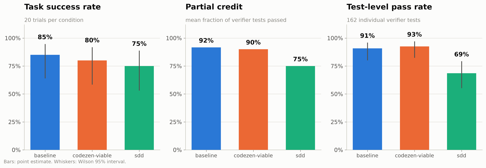
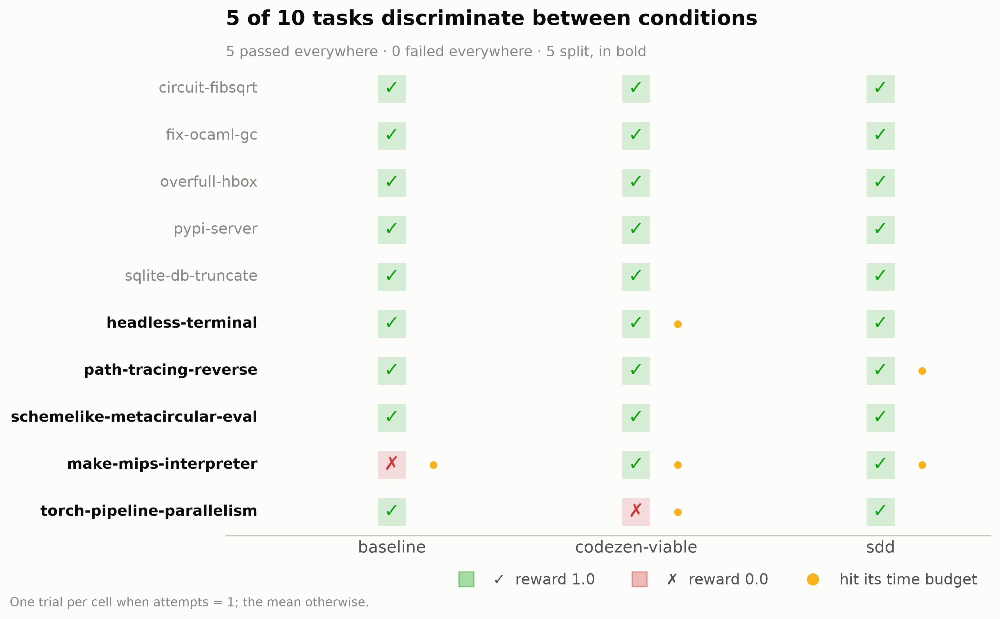
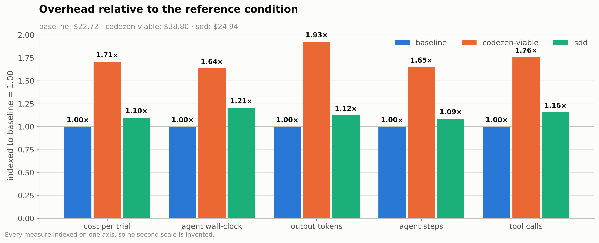
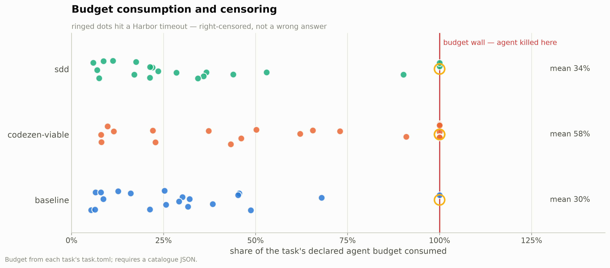
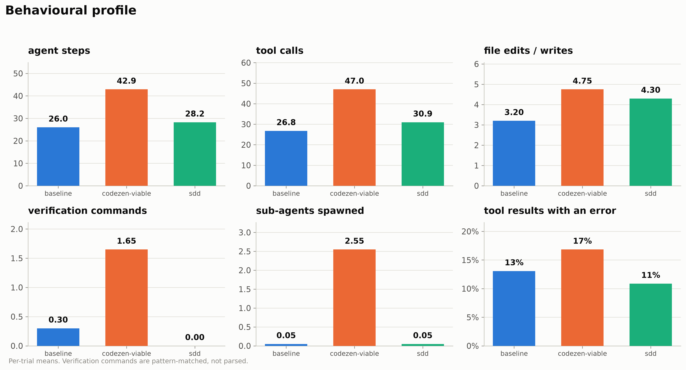
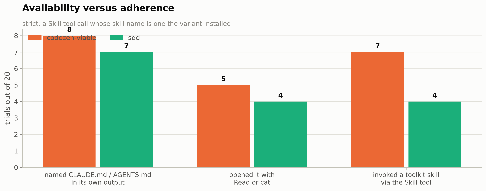

# ceiling — discussion of results

A section-by-section reading of [`ceiling_analysis.ipynb`](ceiling_analysis.ipynb): what each
figure shows, what it supports, and what it cannot. Figures are the ones the notebook
generates into [`figures/`](figures); every number quoted here comes from the executed
notebook or the tables in [`data/`](data).

**The run.** 10 tasks × 3 conditions × **2 attempts** = 60 trials, Claude Code on
`claude-sonnet-5`, executed 2026-09-01 in job `ceiling-claude-code`. $86.46 of model spend,
11.8 h of agent wall-clock. Same three conditions as the `suite` run: `baseline`, `sdd`
(7 skills), `codezen-viable` (4 skills).

**What makes this run different, and why it exists.** Every task here was **rejected** by
`hmb screen` on the grounds that the bare agent already passes it. In the measurement run
that is a disqualifying property: a task at ceiling cannot discriminate between conditions.
This run deliberately measures that population anyway, because two questions can only be
answered there:

1. **What does a methodology cost where it cannot help?** On floored tasks (the `suite`
   run's problem — see [`../analysis-suite/suite_discussion.md`](../analysis-suite/suite_discussion.md) §2)
   nothing finishes, so overhead is measured on aborted work. Here every condition mostly
   succeeds, so cost is measured on completed work. This is the cleaner instrument.
2. **Can a methodology make things worse?** A task the bare agent passes and a methodology
   fails is a regression — direct evidence that process has a downside, not merely a price.

Success rate is **not** an endpoint of this run. Any ordering on it is noise by construction,
and §1 states the numbers only so that §2 can show why they must not be read as a result.
The task list and the selection rule are in
[`../../config/tasks-ceiling-code.txt`](../../config/tasks-ceiling-code.txt).

---

## 0. What is being measured, and why

### Terminal-Bench 2.0 — the benchmark underneath everything

[Terminal-Bench 2.0](https://github.com/harbor-framework/terminal-bench-2) is an agentic
coding benchmark from the Laude Institute, Stanford and Snorkel AI. Each task is a
containerised terminal environment plus a natural-language instruction; an agent is dropped
into the container with a shell and a time budget, and a verifier runs afterwards to decide
whether the work was done.

Three properties matter for reading this experiment:

- **The reward is a verifier, not a judge.** A task passes when its own test suite passes, so
  a methodology only scores by changing the artefact on disk.
- **Tasks are self-contained and fully specified.** The regime in which a specification
  process has least to add — §11 returns to this.
- **Every task declares a wall-clock budget.** Harbor enforces it, which makes §4 a
  first-class result. In this run it is the dominant mechanism.

[Harbor](https://github.com/harbor-framework/terminal-bench) builds each task's image, runs
the agent inside it, runs the verifier, and writes the reward, token counts, cost and a full
trajectory to disk. The task suite is pinned at commit `2fd12b88`; no task is modified.

### `harbor-methodology-bench` — what this repository adds

The repository measures what a repository's agent configuration does to a coding agent. A
"methodology" is what a real checkout carries — `CLAUDE.md`, `AGENTS.md`, a skills
directory, kit templates — frozen at a Git SHA and injected as a **Docker layer** on top of
the task's own base image, because Harbor transfers only `instruction.md`, `tests/` and
`solution/` into a container and a file beside `task.toml` would never reach the agent.

| Question | Answered by |
|---|---|
| Was the methodology **available**? | `hmb preflight` — an assertion made inside the container |
| Did the agent **use** it? | `hmb analysis` — adherence read from the agent's own trajectory |

The generated Dockerfile is byte-identical across conditions, and the `baseline` working
directory is proven byte-identical to the untouched base image. All 30 task variants in this
run had already passed preflight during the screen, and the check was re-asserted before the
run started.

### The three conditions

| Condition | What the agent's working directory contains |
|---|---|
| `baseline` | the benchmark task and nothing else — proven clean |
| `sdd` | the SDD toolkit as shipped: `CLAUDE.md`, `AGENTS.md`, `.sdd-kit/`, 7 skills |
| `codezen-viable` | CodeZen restricted to the 4 container-viable skills: `noc-tdd`, `noc-fix`, `code-review`, `security-review` |

### The task set, and how it was chosen

Ten tasks, all `software-engineering` or `debugging`, drawn from the 57 the screen excluded
for being at ceiling. They were ranked by **expert estimate ÷ agent budget** and the top ten
under 32× taken, on the reasoning that a high ratio means the task is hard relative to the
time allowed, so the ceiling that excluded it is shallowest and a condition has the most room
to separate.

| Task | Category | Expert est. | Budget | Ratio |
|---|---|---:|---:|---:|
| `fix-ocaml-gc` | software-engineering | 1440 m | 60 m | 24.0× |
| `circuit-fibsqrt` | software-engineering | 960 m | 60 m | 16.0× |
| `make-mips-interpreter` | software-engineering | 480 m | 30 m | 16.0× |
| `torch-pipeline-parallelism` | software-engineering | 240 m | 15 m | 16.0× |
| `headless-terminal` | software-engineering | 120 m | 15 m | 8.0× |
| `schemelike-metacircular-eval` | software-engineering | 300 m | 40 m | 7.5× |
| `overfull-hbox` | debugging | 60 m | 12.5 m | 4.8× |
| `path-tracing-reverse` | software-engineering | 120 m | 30 m | 4.0× |
| `pypi-server` | software-engineering | 60 m | 15 m | 4.0× |
| `sqlite-db-truncate` | debugging | 60 m | 15 m | 4.0× |

`path-tracing-reverse` is a sibling of `path-tracing`, which is in the measured suite, so
the two are correlated and should not be read as independent samples.

### Where this run sits in the sequence

`probe3` (3 tasks, gate) → `prog16` (16 tasks selected for expert difficulty; ceiling
effect) → `screen` (83 candidates classified) → `suite` (the 16 kept; floor effect) →
**`ceiling` (10 of the 57 rejected; this run)**. The two 2026-09-01 runs are read together in
[`../codezen-vs-sdd_discussion.md`](../codezen-vs-sdd_discussion.md).

---

## 1. Outcome — reported so it can be set aside

| Condition | Trials | Censored | Graded | Passed | Success rate | 95 % Wilson | Partial credit | Test-level pass rate |
|---|---:|---:|---:|---:|---:|:---:|---:|---:|
| `baseline` | 20 | 1 | 19 | 17 | 89.5 % | [68.6, 97.1] | **0.917** | **90.7 %** |
| `codezen-viable` | 20 | **6** | 14 | 13 | **92.9 %** | [68.5, 98.7] | 0.900 | 92.6 % |
| `sdd` | 20 | 2 | 18 | 14 | 77.8 % | [54.8, 91.0] | **0.750** | **68.5 %** |

The task set is at ceiling, as designed: baseline passes 89.5 % of graded trials. The three
Wilson intervals overlap almost completely, and every pairwise McNemar test in §2 returns
p = 1.000. **No success-rate ordering here is a result.**

**The censoring choice flips the ordering, which is the one thing §1 does establish.**
Counting a timeout as a failure instead of censoring it:

| Condition | Timeout = censored | Timeout = failure |
|---|---:|---:|
| `baseline` | 89.5 % | 85.0 % |
| `codezen-viable` | **92.9 %** | **80.0 %** |
| `sdd` | 77.8 % | 75.0 % |

CodeZen moves from first to second and loses 12.9 points, because 6 of its 20 trials were
censored against baseline's 1. Four censored trials had already finished the work and scored
reward 1.0 — `headless-terminal` twice and `make-mips-interpreter` once under CodeZen,
`make-mips-interpreter` once under SDD — so neither reading is straightforwardly right. This
is the concrete case that makes the censoring question a design decision rather than a
presentational one, and it must be settled before the number is quoted.

**SDD's fine-grained metrics are the exception worth taking seriously.** Partial credit 0.750
against baseline's 0.917, and test-level pass rate 68.5 % against 90.7 % — a 22-point gap
across 54 verifier tests per condition. Unlike the binary rates, this is not a two-trial
artefact: it is a consistent shortfall in how much of each task's test suite SDD satisfied.
The paired test puts it at ratio 0.82, p = 0.125 on 10 tasks — not significant, but the
largest and most consistent negative signal anywhere in either run.

---

## 2. Concordance is expected here — and two tasks still split

The `suite` document's §2 asks whether the design could measure anything, because there it is
a defect. Here concordance is the population's defining property and not a defect at all.
What matters is which tasks broke ranks.

Under **pass-at-2** (passed at least one attempt):

| | Count | Tasks |
|---|---:|---|
| All three pass | 8 | `circuit-fibsqrt`, `fix-ocaml-gc`, `headless-terminal`, `overfull-hbox`, `path-tracing-reverse`, `pypi-server`, `schemelike-metacircular-eval`, `sqlite-db-truncate` |
| All three fail | **0** | — |
| Split | 2 | `make-mips-interpreter`, `torch-pipeline-parallelism` |

| Comparison | Discordant | Only baseline | Only other | Exact McNemar p |
|---|---:|---:|---:|---:|
| baseline vs CodeZen | 2 | 1 | 1 | 1.000 |
| baseline vs SDD | 1 | 0 | 1 | 1.000 |

**Regressions under pass-at-2 — one, not three.** CodeZen lost `torch-pipeline-parallelism`
(baseline passes, CodeZen fails both attempts) and gained `make-mips-interpreter`. SDD lost
nothing and gained `make-mips-interpreter`.

Under **pass-both** (passed both attempts — the definition
[`data/outcome_matrix.csv`](data/outcome_matrix.csv) actually writes) the picture changes
materially:

| | Count |
|---|---:|
| All three pass | 5 |
| All three fail | 2 |
| Split | 3 |

and the regression list grows: SDD loses `headless-terminal`, `path-tracing-reverse` and
`schemelike-metacircular-eval`; CodeZen loses `schemelike-metacircular-eval`.

**Both readings are defensible and they disagree about the run's most interesting claim.**
Pass-at-2 says SDD never regressed a task. Pass-both says it regressed three. The difference
is entirely tasks where SDD passed one attempt and failed the other — that is, tasks it made
*less reliable* without making them impossible. For an operator, reliability is the relevant
property, which argues for reporting pass-both alongside pass-at-2 rather than choosing one.
It is not a licence to quote whichever is more convenient.

**On the selection rule.** `make-mips-interpreter` and `torch-pipeline-parallelism` are the
two highest-ratio tasks in the set (16× each), and both are also the two that failed baseline
under pass-at-2 or pass-both. The ranking rule did what it was meant to — it found the
shallowest ceilings — but it overshot on the top of the range: these two tasks are not
reliably at ceiling at all. The screen had recorded both as "the bare agent already passes
it", on **one** trial. Here baseline failed `make-mips-interpreter` on both attempts. That is
direct evidence that the screen's single-trial inclusion rule is unreliable, and it is the
same defect the `suite` run's floor effect exposes from the other side.

**Interpretation.** Effective n for the outcome comparison is 1–2, exactly as predicted. The
run's value is in §3 and §4, and in the named regressions above.

---

## 3. What the methodology costs where it cannot help

This is the section the run exists for, and it is the strongest result in either run — because
on this population the work actually completes, so the overhead is measured on finished trials
rather than on aborted ones.

| Per-trial mean | `baseline` | `sdd` | `codezen-viable` |
|---|---:|---:|---:|
| Total spend, 20 trials | $22.72 | $24.94 (1.10×) | **$38.80 (1.71×)** |
| Cost per trial | $1.14 | $1.25 | $1.94 |
| Agent wall-clock | 555 s | 669 s (1.21×) | 907 s (1.64×) |
| Output tokens | 40.7 k | 45.7 k (1.12×) | 78.3 k (1.93×) |
| Agent steps | 26.0 | 28.3 (1.09×) | 42.9 (1.65×) |
| Tool calls | 26.8 | 31.0 (1.16×) | 47.0 (1.76×) |
| Sub-agents spawned | 0.05 | 0.05 | **2.55 (51×)** |
| Budget consumed | 30.2 % | 34.3 % | **57.5 % (1.90×)** |

Cache behaviour is identical (96.0 %, 96.1 %, 95.8 %) and thinking share is flat (67.2 %,
65.4 %, 65.7 %), so the extra spend is extra work.

The paired tests are unusually clean:

| Metric | CodeZen ratio | p | Dearer on | SDD ratio | p |
|---|---:|---:|:---:|---:|---:|
| Cost | 1.708× | **0.002** | **10/10** | 1.097× | 0.275 |
| Budget consumed | 1.903× | **0.002** | **10/10** | 1.134× | 0.375 |
| Agent wall-clock | 1.635× | **0.002** | **10/10** | 1.206× | 0.322 |
| Output tokens | 1.925× | **0.002** | **10/10** | 1.123× | 0.375 |
| Tool calls | 1.757× | **0.016** | 8/10 | 1.157× | 0.272 |
| Agent steps | 1.650× | **0.020** | 8/10 | 1.087× | 0.272 |
| Partial credit | 0.982× | 0.750 | 1/10 | 0.818× | 0.125 |

**CodeZen is more expensive on every single one of the ten tasks** on four separate metrics,
at p = 0.002 — the minimum attainable p for a two-sided Wilcoxon test at n = 10. There is no
task on which its overhead does not appear, and no runaway task carrying the mean. Its cost
ratio per task ranges from 1.01× (`sqlite-db-truncate`) to 10.6× (`headless-terminal`).

SDD's overhead is 1.10× and indistinguishable from zero on every metric, exactly as in the
`suite` run.

**Interpretation.** On tasks the bare agent solves, CodeZen buys 1.71× the spend, 1.93× the
tokens and 1.90× the budget consumption for **0.98× the partial credit**. This is the
cleanest statement of the cost finding either run produces, and it is the reason the probe was
worth $86.46: the `suite` run's 3.11× ratio is inflated by trials that ran to the wall
without finishing, whereas this 1.71× is what the overhead costs on work that completes.
Read the two together, not as a contradiction — they are overhead on aborted and on completed
work respectively.

---

## 4. The budget wall is the mechanism

| Condition | Mean budget consumed | Median | Trials over 75 % | Agent timeouts |
|---|---:|---:|---:|---:|
| `baseline` | 30.2 % | 27.5 % | 1 | 1 |
| `sdd` | 34.3 % | 22.8 % | 3 | 2 |
| `codezen-viable` | **57.5 %** | 56.2 % | **7** | **6** |

CodeZen consumes 1.90× baseline's share of the declared budget (p = 0.002, higher on 10 of
10 tasks) and is censored on 6 of 20 trials against baseline's 1. Seven of its 20 trials ran
past 75 % of budget; on `headless-terminal`, `make-mips-interpreter` and
`torch-pipeline-parallelism` it consumed **100 %** — the wall — on both attempts.

This is the causal chain, and on this population it is fully visible:

1. CodeZen delegates (2.55 sub-agents per trial against 0.05) and reviews after implementing.
2. That work is real and takes wall-clock, so budget consumption rises 1.90×.
3. On tasks whose budget is tight relative to their size, the extra consumption crosses the
   wall and Harbor kills the agent.
4. Sometimes the work was already done — 3 of CodeZen's 6 censored trials scored 1.0.
   Sometimes it was not — `torch-pipeline-parallelism`, the one clear regression in §2,
   is a task where CodeZen hit 100 % of budget on both attempts and scored 0 both times,
   while baseline finished it inside 34 %.

**`torch-pipeline-parallelism` is the run's cleanest single finding.** Baseline passes it
using a third of the budget. CodeZen invoked `code-review` on one attempt and
`noc-tdd`+`code-review` on the other, hit the wall both times, and failed both times. That is
a methodology converting a solved task into an unsolved one, with the mechanism recorded in
the trajectory rather than inferred.

**Interpretation.** The budget wall is not an artefact to be corrected away — an operator
running under a real deadline faces the same arithmetic. But it does mean the reported
success rates are partly a statement about Terminal-Bench's budget calibration, and that
tasks whose budgets are tight relative to their expert estimate are where methodology risk
concentrates. The cross-run document tests that as a quantitative hypothesis.

---

## 5. What the agent actually did differently

| Per-trial mean | `baseline` | `sdd` | `codezen-viable` |
|---|---:|---:|---:|
| Agent steps | 26.0 | 28.3 | 42.9 |
| Tool calls | 26.8 | 31.0 | 47.0 |
| File edits / writes | 3.20 | 4.30 | 4.75 |
| Verification commands | 0.30 | **0.00** | 1.65 |
| Sub-agents spawned | 0.05 | 0.05 | 2.55 |
| File reads | 2.95 | 4.40 | 6.85 |
| Tool results containing an error | 13.1 % | 10.9 % | 16.9 % |

**SDD ran zero verification commands across 20 trials.** Baseline ran 0.30 per trial and
CodeZen 1.65. For a methodology that ships an `sdd-verify` skill — and that invoked
`sdd-verify` in two of its four skill-using trials — this is a direct counter-signal, and it
lines up with the partial-credit shortfall in §1: SDD satisfied 68.5 % of verifier tests
against baseline's 90.7 %, and it checked its work less than the bare agent did.

The caveat matters here more than usual: shell commands are bucketed by pattern, not parsed,
so verification done inline in a heredoc is invisible to the bucket. Read 0.00 as "no
recognised test invocation", not as proof that nothing was checked. But the same bucket
credits baseline with 0.30 and CodeZen with 1.65 on the same corpus, so the *comparison*
stands even if the absolute count understates.

**CodeZen's signature is unchanged from the `suite` run:** 51× the sub-agent spawns, 2.3× the
file reads, 5.5× the verification commands, at 1.7× the tool calls and the highest error rate
of the three.

**Interpretation.** Both toolkits change behaviour, and CodeZen changes it in the direction
its documentation claims. On this population neither change converts into outcome, and SDD's
change points the wrong way on the one metric with enough resolution to see it.

---

## 6. Adherence: the toolkits engage more here than on the floor

> **Instrumentation note.** "Trials naming an instruction file" was previously counted with
> `config_markers.notna()`. That column holds `""` rather than `NaN` when nothing was seen, so
> the count returned every trial including baseline's 20, which ship no instruction file. The
> comparison is now `.fillna("").ne("")`; the template carries the fix and this notebook was
> re-executed. Only the adherence row moved.

Out of 20 trials per condition, under the strict definition — a `Skill` tool call naming a
skill the variant installed:

| | `baseline` | `sdd` | `codezen-viable` |
|---|---:|---:|---:|
| Skills shipped | 0 | 7 | 4 |
| Registered by the CLI | 0 | 7 | 4 |
| Named `CLAUDE.md` / `AGENTS.md` in its own output | 0 | 7 | 8 |
| Opened an instruction file | 0 | 4 | 5 |
| **Invoked a toolkit skill** | 0 | **4** | **7** |
| Toolkit `Skill` calls in total | 0 | 13 | 17 |

Eleven of 60 trials invoked a toolkit skill. Compared with the `suite` run the rates are
similar for CodeZen (35 % here, 38 % there) and lower for SDD (20 % here, 22 % there), but
SDD's *mentions* of its instruction files rose sharply — 7 of 20 here against 3 of 32 there.

The 11 skill-using trials in full:

| Task | Condition | Skills invoked | Reward | Budget | Outcome |
|---|---|---|---:|---:|---|
| `headless-terminal` | CodeZen | `noc-tdd`, `code-review`, `noc-fix`, `security-review` | 1.0 | 100 % | pass, then censored |
| `headless-terminal` | CodeZen | `noc-tdd`, `code-review`, `security-review` | 1.0 | 100 % | pass, then censored |
| `make-mips-interpreter` | CodeZen | `code-review`, `noc-fix` | 0.0 | 100 % | fail, censored |
| `make-mips-interpreter` | CodeZen | `noc-tdd`, `code-review` | 1.0 | 100 % | pass, then censored |
| `pypi-server` | CodeZen | `noc-tdd`, `code-review`, `security-review` | 1.0 | 50 % | pass |
| `torch-pipeline-parallelism` | CodeZen | `code-review` | 0.0 | 100 % | **fail, censored** |
| `torch-pipeline-parallelism` | CodeZen | `noc-tdd`, `code-review` | 0.0 | 100 % | **fail, censored** |
| `headless-terminal` | SDD | `sdd-specify`, `sdd-clarify` | 0.0 | 11 % | fail, abandoned |
| `make-mips-interpreter` | SDD | `sdd-specify`, `sdd-analyze`, `sdd-verify` | 0.0 | 90 % | fail |
| `schemelike-metacircular-eval` | SDD | `specify`, `plan`, `tasks`, `analyze`, `implement`, `verify` | 0.0 | 53 % | fail |
| `torch-pipeline-parallelism` | SDD | `sdd-specify`, `sdd-clarify` | 0.0 | 17 % | fail |

**Every trial in this table that invoked a skill and did not pass, failed.** More precisely:
of the 11 skill-using trials, 4 passed and 7 failed, against a run-wide pass rate of 77–93 %.
That is not a causal claim — the toolkits plausibly invoke themselves on the tasks they
judge hardest, which is selection, not effect — but it is the pattern, and it is the reverse
of what a working methodology would produce.

**SDD's abandonment pattern repeats.** Two of its four skill-using trials stop after
`sdd-specify` and `sdd-clarify` having spent 11 % and 17 % of budget: the agent opened the
process, produced a specification, and then did not follow it. This is the same shape as the
`suite` run's three abandoned chains.

**Interpretation.** Availability was total; invocation was rare and concentrated on tasks
that failed. The cross-run document tests whether the concentration is explained by task
length, and finds the first quantitative evidence that SDD self-gates on task size.

---

## 7. Where the effort goes inside a trial

Unlike the `suite` run, this population supports a profile analysis: 8 of 10 tasks pass in
every condition, so time-to-first-passing-test exists nearly everywhere.
[`data/steps.csv`](data/steps.csv) and [`data/tool_calls.csv`](data/tool_calls.csv) carry the
per-step detail.

The pattern that matters is the relationship between budget consumption and outcome. Baseline
finishes at a median 27.5 % of budget; CodeZen at 56.2 %. Since both mostly succeed, CodeZen's
extra 29 points of budget are not buying outcome — they are consumed before the same result is
reached. Where a task's budget is tight, those points are the difference between finishing and
being killed, which is §4.

Error rate rises with tool-call volume (baseline 13.1 % at 26.8 calls, CodeZen 16.9 % at 47.0),
so CodeZen's additional work is also slightly lower-yield per call.

**Interpretation.** The overhead is not a fixed setup cost that finishes early — it
accumulates through the trial, which is why it converts into censoring rather than into a
constant delay.

---

## 8. Cost-effectiveness

| Condition | Passes (graded) | Spend | Spend per pass |
|---|---:|---:|---:|
| `baseline` | 17 | $22.72 | **$1.34** |
| `sdd` | 14 | $24.94 | $1.78 |
| `codezen-viable` | 13 | $38.80 | $2.98 |

Baseline is 25 % cheaper per pass than SDD and **55 % cheaper than CodeZen**. Unlike the
`suite` run, there is no marginal-success framing available: both methodologies produced
*fewer* graded passes than baseline while spending more, so cost per pass is the whole story.

At CodeZen's $38.80, baseline would buy roughly 34 trials instead of 20 — 70 % more attempts
on the same ten tasks. Given that baseline already passes 89.5 % of them, the extra attempts
would be nearly wasted, which is the honest version of the equal-budget comparison on this
population: neither more process nor more retries helps when the task is already solved. The
overhead is simply a loss.

**Interpretation.** For an operator whose workload resembles this set — code tasks the bare
agent handles — the run says plainly: the methodology is a 1.7× cost with a measurable
downside risk and no measurable benefit. That is a decision-grade finding for a configuration
choice, and it is bounded to this population.

---

## 9. What this run supports, and what it does not

**Supported.**

1. **CodeZen costs 1.71× baseline on tasks that complete**, and is more expensive on 10 of 10
   paired tasks across cost, budget, wall-clock and output tokens at p = 0.002. This is the
   most robust comparative result in the whole experiment sequence.
2. **CodeZen's overhead converts into censoring risk**: 1.90× budget consumption, 6 of 20
   trials censored against baseline's 1, and 100 % of budget consumed on both attempts of
   three separate tasks.
3. **Methodology can regress a solved task.** `torch-pipeline-parallelism`: baseline passes
   inside 34 % of budget, CodeZen hits the wall and fails on both attempts. Under the
   pass-both reading SDD also regresses three tasks.
4. **SDD satisfies less of each verifier than baseline does** — partial credit 0.750 vs 0.917,
   test-level pass rate 68.5 % vs 90.7 % — and ran zero recognised verification commands
   across 20 trials.
5. The censoring convention is decision-relevant, not cosmetic: it moves CodeZen by 12.9
   points and changes its rank against baseline.
6. The screen's single-trial inclusion rule is unreliable in both directions.
   `make-mips-interpreter` was screened out as "the bare agent already passes it" and baseline
   failed both attempts here.

**Not supported.**

1. Any success-rate comparison. Every McNemar p is 1.000, effective n is 1–2, and the
   population was selected to be at ceiling.
2. That SDD's partial-credit shortfall is real rather than noise: p = 0.125 at n = 10. It is
   the strongest negative signal available and it is still not significant.
3. Any causal reading of §6's "skill-using trials mostly failed". The toolkits plausibly
   invoke themselves on the tasks they judge hardest; this design cannot separate selection
   from effect.
4. Generalisation beyond ten `software-engineering` / `debugging` tasks, one of which
   (`path-tracing-reverse`) is a sibling of a task in the measured suite.

**Confounds.**

- **`codezen-viable` is a curated 4-skill subset** of an 11-skill toolkit; the rest cannot run
  in a container.
- **Payload breadth** — the whole toolkit repository lands in the working directory, so the
  condition is "a repository configured this way", not "the methodology text".
- **Adherence instrumentation is textual** and cannot see a silently-loaded `CLAUDE.md`; shell
  buckets are pattern matches, which is why SDD's 0.00 verification commands needs the caveat
  in §5.
- **Concurrency** — 9 trials at a time, so wall-clock and therefore `budget_used` carry host
  contention. Cost and token metrics do not. Because contention is symmetric across
  conditions within a task, the paired comparisons are still valid; the absolute budget
  percentages are inflated.
- **Selection by ratio** put the two least-reliable tasks at the top of the set (§2).

---

## 10. What to change before the next run

| Change | Why |
|---|---|
| **Settle the censoring convention in writing before the next run** | It moves CodeZen 12.9 points and changes its rank here. Deciding after seeing the numbers is not a defensible order of operations |
| **Report pass-at-2 and pass-both side by side** | They disagree about whether SDD regressed 0 or 3 tasks, and the difference is exactly the reliability question an operator cares about |
| **Re-verify `make-mips-interpreter` and `torch-pipeline-parallelism` against the oracle** | Both split; both were screened as ceiling on one trial. Costs no model tokens and settles whether they belong in either set |
| **Grade the workdir at the moment of the kill** | 4 of 9 censored trials scored 1.0 anyway. Grading at kill time would turn censoring from a lost observation into a measured one |
| Parse verification commands instead of bucketing them | SDD's 0.00 is the run's most striking behavioural number and it rests on a pattern match |
| Add a delegation column to `hmb report` | 2.55 sub-agents per CodeZen trial is its entire cost mechanism and the cell-level report cannot see it |
| Re-run this probe with baseline at equal *budget* rather than equal attempts | §8's equal-budget argument is currently arithmetic, not measurement |

---

## 11. Open questions that would sharpen the interpretation

These are questions about intent, not about data. Several of them are the same questions the
`prog16` and `suite` runs left open; this run's evidence changes what can be said about them,
and the cross-run document works that through explicitly.

1. **Is "cost where it cannot help" the right endpoint for a ceiling population?** This run
   answers it decisively (§3). But an operator's workload is a mixture of ceiling, floor and
   discriminating tasks, and the right weighting of a 1.71× tax on the ceiling portion depends
   on how large that portion is — which this experiment has not measured.
2. **Should a timeout count as a failure?** §1 makes this concrete rather than theoretical:
   the answer moves CodeZen from first to second place.
3. **Is a regression on a ceiling task more or less serious than a failure on a hard one?**
   `torch-pipeline-parallelism` under CodeZen is a solved task made unsolved. Whether that
   outranks any amount of cost is a judgement about risk tolerance, not about data.
4. **Does the population definition survive contact with the data?** Two of these ten tasks
   are not reliably at ceiling, and the `suite` run's set turned out not to be reliably
   discriminating. If "at ceiling", "discriminating" and "at floor" cannot be assigned
   reliably from one baseline trial, then every task-set-based design in this sequence rests
   on an unreliable partition.
5. **Is low adherence a toolkit property or a harness artefact?** §6 shows both toolkits
   engaging more here than on the floor set, and mentioning their instruction files more. That
   is weak evidence for self-gating rather than suppression, and the cross-run length analysis
   sharpens it.
6. **Should the methodology be mandated rather than merely available?** If the intent is to
   measure the method as practised, a prompt instructing the agent to follow the repository's
   process would change the condition from "available" to "mandated". That is a different
   experiment and it would answer a different question — but it is the one most people mean
   when they ask whether a methodology works.
7. **What would falsify the cost finding?** A population where the methodology's success rate
   exceeds baseline's by enough to justify 1.71×. Neither run has found one, and neither run
   has looked in the place where such a population would most plausibly live: multi-session
   work with ambiguous requirements and a human in the loop.
