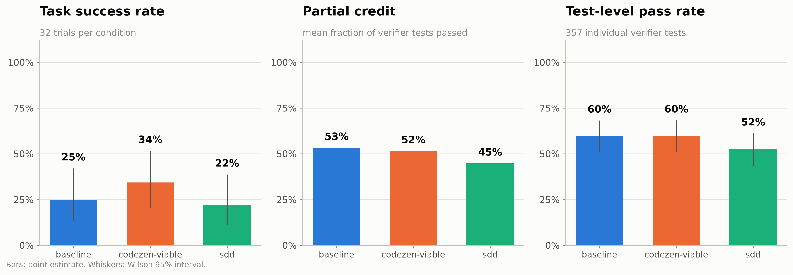
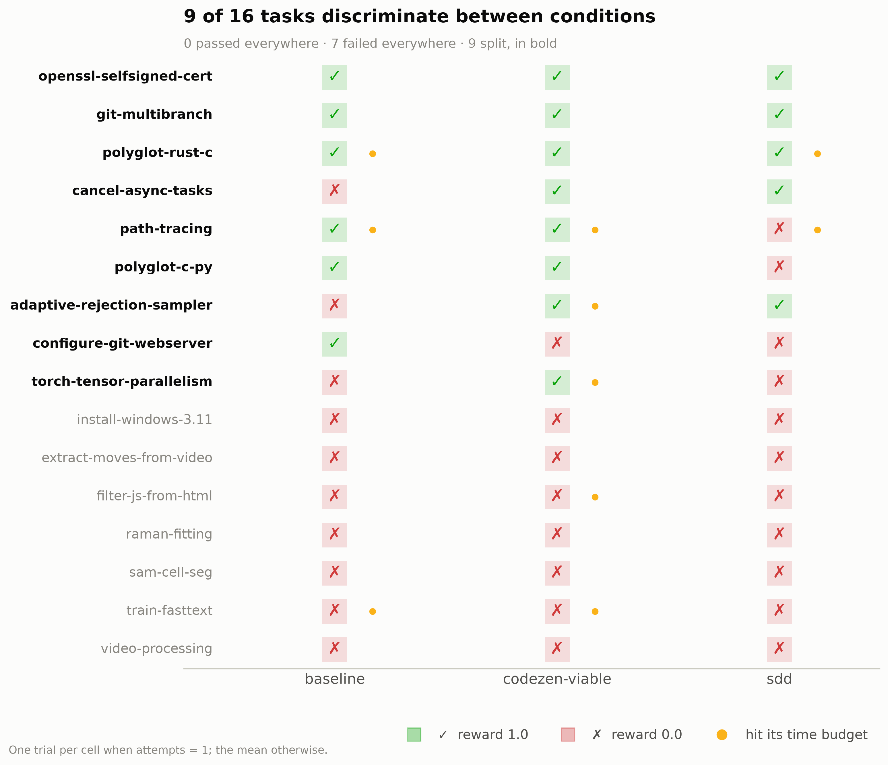
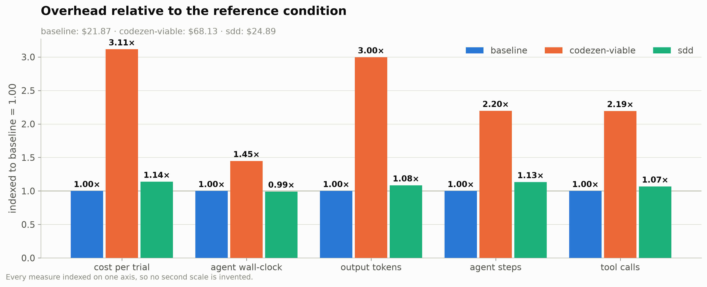
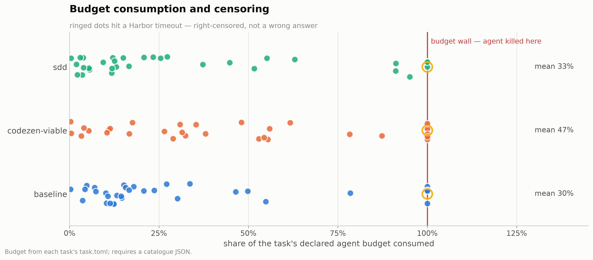
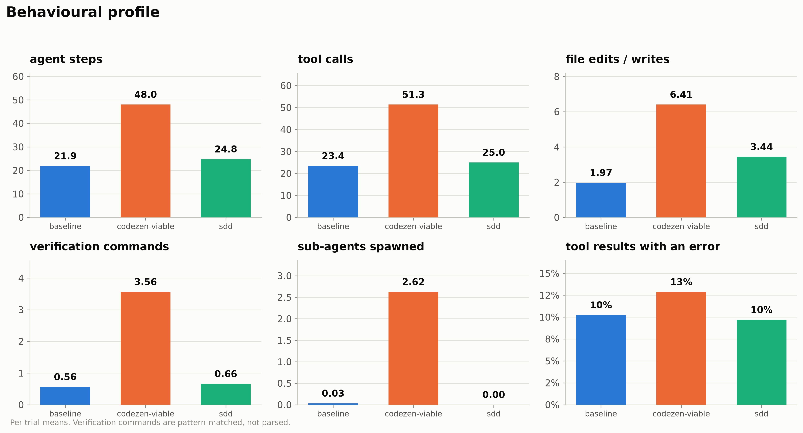
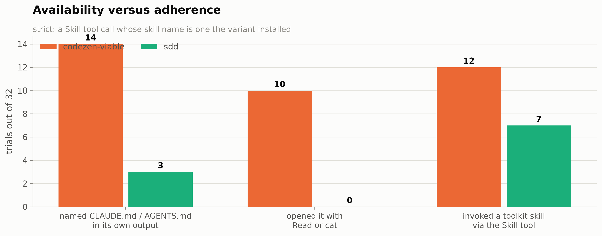

# suite — discussion of results

A section-by-section reading of [`suite_analysis.ipynb`](suite_analysis.ipynb): what each
figure shows, what it supports, and what it cannot. Figures are the ones the notebook
generates into [`figures/`](figures); every number quoted here comes from the executed
notebook or the tables in [`data/`](data).

**The run.** 16 screened tasks × 3 conditions × **2 attempts** = 96 trials, Claude Code on
`claude-sonnet-5`, executed 2026-08-31 to 2026-09-01 in job `suite-claude-code`. $114.90 of
model spend, 18.3 h of agent wall-clock. Conditions: `baseline` (the benchmark task and
nothing else), `sdd` (the SDD toolkit as shipped, 7 skills), `codezen-viable` (the 4-skill
CodeZen subset that can run inside a benchmark container).

Two properties of the run matter before any number is read.

**The task set is a derivation, not a selection.** Every task here survived
`hmb screen`: the oracle agent scored 1.0, the `nop` agent scored 0.0, and the bare agent
failed. That screen exists because the previous run in this sequence (`prog16`) was
destroyed by a ceiling effect — the agent passed 10 of 16 tasks unaided, so most of the
spend bought no information. The screen was the fix.

**The fix overcorrected.** §2 is the substance of this document: the screen replaced a
ceiling effect with a floor effect. Seven of these 16 tasks are failed by all three
conditions, and the effective sample size per pairwise comparison is 4 to 5 — no better
than the run it was designed to repair.

---

## 0. What is being measured, and why

### Terminal-Bench 2.0 — the benchmark underneath everything

[Terminal-Bench 2.0](https://github.com/harbor-framework/terminal-bench-2) is an agentic
coding benchmark from the Laude Institute, Stanford and Snorkel AI. Each task is a
containerised terminal environment plus a natural-language instruction; an agent is dropped
into the container with a shell and a time budget, and a verifier runs afterwards to decide
whether the work was actually done. The pool holds 89 tasks across 16 categories at easy,
medium and hard difficulty.

Three properties of that design matter for reading this experiment:

- **The reward is a verifier, not a judge.** A task passes when its own test suite passes.
  There is no model grading style or process, so a methodology only scores by changing the
  artefact on disk.
- **Tasks are self-contained and fully specified.** The instruction states what done means.
  This is the regime in which a specification process has least to add — a point §11
  returns to.
- **Every task declares a wall-clock budget** for the agent. Harbor enforces it, which is
  what makes §4 a first-class result rather than a footnote.

[Harbor](https://github.com/harbor-framework/terminal-bench) is the execution framework: it
builds each task's image, runs the agent inside it, runs the verifier, and writes the
reward, token counts, cost and a full agent trajectory to disk. This repository pins the
task suite at commit `2fd12b88` and never modifies a task.

### `harbor-methodology-bench` — what this repository adds

The repository measures one thing: **what a repository's agent configuration does to a
coding agent's performance.** A "methodology" here is what a real checkout carries — a
`CLAUDE.md` or `AGENTS.md`, a skills directory, slash commands, kit templates — frozen at a
Git SHA and deployed into the benchmark container.

The mechanism matters, because the naive version of this experiment silently measures
nothing. Harbor transfers only `instruction.md`, `tests/` and `solution/` into a container,
so a `CLAUDE.md` sitting next to `task.toml` never reaches the agent. This repository
therefore injects the methodology as a **Docker layer** on top of the task's own base
image, and then proves from *inside* each container that the condition is what was declared:

| Question | Answered by |
|---|---|
| Was the methodology **available** to the agent? | `hmb preflight` — an assertion made inside the container |
| Did the agent **use** it? | `hmb analysis` — adherence read from the agent's own trajectory |

The generated Dockerfile is byte-identical across every condition of a task, and the
`baseline` container's working directory is proven byte-identical to the untouched base
image, so no build-path difference can be mistaken for a methodology effect. All 48 task
variants in this run passed preflight before a single trial started.

### The three conditions in this run

| Condition | What the agent's working directory contains |
|---|---|
| `baseline` | the benchmark task and nothing else — the pure agent, proven clean |
| `sdd` | the SDD toolkit as shipped: `CLAUDE.md`, `AGENTS.md`, `.sdd-kit/`, and 7 installed skills (`sdd-specify`, `sdd-clarify`, `sdd-plan`, `sdd-tasks`, `sdd-analyze`, `sdd-implement`, `sdd-verify`) |
| `codezen-viable` | the CodeZen plugin reprojected as a repository, restricted to the 4 skills that can run inside a benchmark container: `noc-tdd`, `noc-fix`, `code-review`, `security-review` |

`codezen-viable` is a curated subset by necessity — CodeZen's other skills need a Docker
daemon, a human, a running system under test, or the Notion MCP server, none of which exist
in a benchmark container. That is a stated confound, not an oversight.

### The question this run was built to answer

> Does working inside a repository configured with a coding methodology make a coding agent
> better, worse, or merely more expensive — and does the agent actually follow the
> methodology when it is available?

Both halves are load-bearing. A condition that is available but unused is a finding about
the toolkit, not about methodology in general, which is why the framework instruments
availability and adherence separately and why §6 carries as much weight here as §1.

### Where this run sits in the sequence

1. **`probe3` (2026-08-26)** — 3 tasks × 4 conditions × 1 attempt, 12 trials, $24.94. A
   gate on whether the full measurement was worth paying for. The predicted null (zero
   adherence) did not happen, so the gate opened.
2. **`prog16` (2026-08-27)** — 16 programming tasks × 3 conditions × 1 attempt, $75.49.
   Result: a null on outcome, a measured cost, and a ceiling effect that made the null
   uninformative. Its §10 recommended screening candidate tasks before including them.
3. **`screen` (2026-08-31)** — that recommendation, executed. 83 candidate tasks run
   against the oracle agent, the `nop` agent and one bare baseline trial. 16 kept, 64
   excluded, 3 undecided. Written to `config/tasks-suite.txt`.
4. **This run (`suite`, 2026-08-31/09-01)** — the screened set at 2 attempts, $114.90.
5. **`ceiling` (2026-09-01)** — 10 of the tasks the screen *rejected*, as a cost and
   regression probe. Analysed in
   [`../analysis-ceiling/ceiling_discussion.md`](../analysis-ceiling/ceiling_discussion.md);
   the two runs are read together in
   [`../codezen-vs-sdd_discussion.md`](../codezen-vs-sdd_discussion.md).

What would have counted as a positive result: a consistent direction across the 16 paired
tasks, ideally concentrated in the axes each toolkit claims. What was obtained is a null on
outcome, a large and significant cost, and a design problem that is the mirror image of
`prog16`'s.

---

## 1. The headline: no outcome difference that survives a second metric

Timeouts are reported as **censored** rather than failed: the agent was stopped, not beaten,
and folding a stopped trial into a failure rate biases against exactly the conditions that
add process. Success rate and partial credit below are over the graded trials.

| Condition | Trials | Censored | Graded | Passed | Success rate | 95 % Wilson | Partial credit | Test-level pass rate |
|---|---:|---:|---:|---:|---:|:---:|---:|---:|
| `baseline` | 32 | 4 | 28 | 7 | 25.0 % | [12.7, 43.4] | **0.533** | **59.8 %** (117 tests) |
| `codezen-viable` | 32 | 7 | 25 | 9 | **36.0 %** | [20.2, 55.5] | 0.516 | 60.0 % (120 tests) |
| `sdd` | 32 | 3 | 29 | 7 | 24.1 % | [12.2, 42.1] | 0.448 | 52.5 % (120 tests) |

**The metrics disagree, and that is the finding.** Success rate ranks CodeZen first by 11
points. Partial credit — the mean fraction of each verifier's own tests that passed, 357
graded test outcomes instead of 96 binary ones — ranks baseline first, with CodeZen 0.017
below it and SDD 0.085 below. Test-level pass rate agrees with partial credit.

If a methodology effect existed and the binary reward were merely too coarse to see it,
partial credit is where it would appear first, because it is roughly 3.7× the graded
outcomes from the same trials. It does not appear. What appears instead is a coarse metric
moving one way by two trials and a fine metric moving the other way.

The Wilson intervals contain each other completely. At n = 25–29 the interval on 36 % runs
from 20 % to 56 %; one task moves the point estimate by about 4 points.

**The censoring choice moves the ordering.** Counting a timeout as a failure instead:
baseline 8/32 = 25.0 %, CodeZen 11/32 = 34.4 %, SDD 7/32 = 21.9 %. The ordering survives,
but three censored trials scored reward **1.0** — the agent finished the work and was then
killed by the clock: `path-tracing` (baseline), `adaptive-rejection-sampler` and
`torch-tensor-parallelism` (both CodeZen). Censoring drops those from numerator *and*
denominator; counting them as the successes they are gives baseline 27.6 %, CodeZen 40.7 %,
SDD 24.1 %. Every reading leaves CodeZen nominally ahead on the binary metric and behind on
the finer one.

### Paired tests

Every task ran in every condition, so the correct tests are exact McNemar on the binary
outcome and Wilcoxon signed-rank on the continuous quantities.

With `--attempts 2`, "did this task pass" has two defensible definitions, and they give
different matrices. Both are reported throughout this document:

- **pass-at-2** — passed at least one attempt (`aggfunc="max"`). The standard reading for a
  multi-attempt run.
- **pass-both** — passed both attempts (`aggfunc="mean"`, then `== 1`). This is what
  [`data/outcome_matrix.csv`](data/outcome_matrix.csv) currently writes, which is a
  reporting trap worth knowing about: the file's name does not say which definition it used.

| Comparison | Discordant (pass-at-2) | Exact McNemar p |
|---|---:|---:|
| baseline vs CodeZen | 4 | 0.625 |
| baseline vs SDD | 5 | 1.000 |

Of the eight paired continuous comparisons against baseline, CodeZen clears p < 0.05 on
five: cost (p = 0.009), tool calls (p = 0.010), steps (p = 0.013), output tokens (p = 0.016)
and sub-agent spawns (p = 0.027). SDD clears none; its best is p = 0.44 on partial credit,
in the *negative* direction. Partial credit for CodeZen is p = 1.000 with a ratio of 0.96.

**Interpretation.** On this task set, at two attempts per cell, neither methodology changed
the outcome. Both changed the cost, one of them enormously. That is the shape of the result;
§2 is why the outcome half of it is uninformative rather than negative.

---

## 2. Could this design measure anything? The screen overcorrected

A paired comparison learns nothing from a task that all conditions pass or all conditions
fail. Reading the matrix under pass-at-2:

| | Count | Tasks |
|---|---:|---|
| **All three pass** | 3 | `git-multibranch`, `openssl-selfsigned-cert`, `polyglot-rust-c` |
| **All three fail** | **7** | `extract-moves-from-video`, `filter-js-from-html`, `install-windows-3.11`, `raman-fitting`, `sam-cell-seg`, `train-fasttext`, `video-processing` |
| **Split** | 6 | `adaptive-rejection-sampler`, `cancel-async-tasks`, `configure-git-webserver`, `path-tracing`, `polyglot-c-py`, `torch-tensor-parallelism` |

Ten of 16 tasks are concordant, and they consumed **$74.47 of the $114.90** spent (65 %).
The effective sample size per pairwise comparison is 4 to 5, not 16.

Under pass-both the picture is worse: **zero** tasks pass in all three conditions, 11 fail
in all three, and 5 split. Baseline passes both attempts on 2 of 16 tasks.

**This is a floor effect, and it is the mirror image of `prog16`'s ceiling effect.** The
comparison is worth making explicitly, because the screen was built to fix `prog16` and
this is what it produced:

| Run | Task set | Baseline pass (pass-at-2) | Concordant tasks | Effective n |
|---|---|---:|---:|---:|
| `prog16` | selected for human-expert difficulty | 13/16 = 81 % | 11/16 (ceiling) | 2–5 |
| `suite` | screened: bare agent must fail | **6/16 = 37.5 %** | 10/16 (floor) | 4–5 |
| `ceiling` | screened: bare agent must pass | 9/10 = 90 % | 8/10 (ceiling) | 1–2 |

The screen worked exactly as specified and still did not deliver a discriminating set. Its
inclusion rule — *the bare agent fails this task* — was applied on **one** baseline trial
per candidate. A single trial cannot distinguish "the agent fails this task" from "the agent
fails this task sometimes", and the two have completely different consequences for a paired
design. Tasks of the first kind are floor tasks and carry no information; only tasks of the
second kind discriminate.

That is a fixable specification error, not bad luck. The screen needs a two-sided rule:
include a task when the bare agent's pass rate is bounded away from both 0 and 1 — which
requires 3 or more baseline trials per candidate, not one.

**Interpretation.** The null in §1 is uninformative about the hypothesis, for the same
reason `prog16`'s was: the design could not have rejected it. The fix is not more attempts
on these tasks, and it is not a stricter version of this screen. It is a screen that
measures baseline *variance* rather than a single baseline outcome.

---

## 3. What the methodology reliably does cost

Cost is a continuous per-trial quantity rather than a rare binary event, so it is measurable
at n = 16 where the outcome is not. This is the section where the run delivers.

| Per-trial mean | `baseline` | `sdd` | `codezen-viable` |
|---|---:|---:|---:|
| Total spend, 32 trials | $21.87 | $24.89 (1.14×) | **$68.13 (3.11×)** |
| Cost per trial | $0.68 | $0.78 | $2.13 |
| Agent wall-clock | 598 s | 593 s (0.99×) | 866 s (1.45×) |
| Output tokens | 26.9 k | 29.2 k (1.08×) | 80.6 k (3.00×) |
| Agent steps | 21.9 | 24.8 (1.13×) | 48.0 (2.20×) |
| Tool calls | 23.4 | 25.0 (1.07×) | 51.3 (2.19×) |
| Sub-agents spawned | 0.03 | 0.00 | **2.63 (84×)** |
| File edits / writes | 1.97 | 3.44 (1.75×) | 6.41 (3.25×) |
| Budget consumed | 30.2 % | 33.1 % | 46.8 % |

Cache behaviour is effectively identical across conditions (cache hit ratio 94.8 %, 93.4 %,
94.5 %; thinking tokens 59.5 %, 60.7 %, 59.2 % of output), so the extra spend is extra work,
not a caching artefact.

The paired view answers the obvious objection — that one runaway task inflated a mean.
CodeZen is dearer on **12 of 16** tasks (median Δ +$0.34, ratio of totals 3.11×, p = 0.009).
SDD is dearer on 9 of 16 (median Δ +$0.005, ratio 1.14×, p = 0.82) — a coin flip.

CodeZen's overhead is broad but not uniform. Its cost ratio per task ranges from 0.06×
(`extract-moves-from-video`, where it gave up early) to **16.0×**
(`filter-js-from-html`, where it ran to the budget wall twice). The mechanism is visible in
the same table: 2.63 sub-agents spawned per trial against baseline's 0.03. `noc-tdd` and
`code-review` both fan work out, and delegated work is billed.

**Interpretation.** The methodology tax is real, large, and for CodeZen statistically solid
at this sample size: **3.11× the spend, 2.2× the steps, 3.0× the output tokens, for 0.96×
the partial credit.** SDD's tax is 1.14× and indistinguishable from zero. This is the only
comparative claim in the run with both significance and a mechanism behind it.

---

## 4. How methodology can actively hurt: the budget wall

Each task declares an agent time budget in its `task.toml`; Harbor kills the agent there and
grades whatever is on disk. The relevant quantity is not absolute duration but the share of
the declared budget consumed.

| Condition | Mean budget consumed | Median | Trials over 75 % | Agent timeouts | Verifier timeouts |
|---|---:|---:|---:|---:|---:|
| `baseline` | 30.2 % | 15.4 % | 5 | 4 | 0 |
| `sdd` | 33.1 % | 15.8 % | 6 | 3 | 0 |
| `codezen-viable` | **46.8 %** | 36.7 % | **9** | **7** | 0 |

CodeZen is censored on 7 of 32 trials against baseline's 4 and SDD's 3, and its paired
budget-consumption delta against baseline is +0.17 (p = 0.093). Three censored trials had
already finished the work and scored 1.0 (§1), so censoring is not synonymous with failure —
but the four that scored 0 include `filter-js-from-html` twice, where CodeZen consumed
100 % of the budget on both attempts against baseline's 12.7 %.

A timeout is right-censoring, not a wrong answer. Folding it into a success rate silently
converts "we stopped watching" into "it failed". This run reports censoring separately for
that reason, and §1 shows the ordering is not sensitive to the choice here — though the
*magnitudes* move by up to 5 points.

**Interpretation.** The causal path by which a methodology loses on this benchmark is
visible and measured: extra planning, review and delegation consume budget headroom, and on
budget-bound tasks that headroom is the margin. It is a property of the benchmark's fixed
budgets as much as of the methodology, and it should be stated as such — but an operator
running under a real time budget faces the same arithmetic.

---

## 5. What the agent actually did differently

| Per-trial mean | `baseline` | `sdd` | `codezen-viable` |
|---|---:|---:|---:|
| Agent steps | 21.9 | 24.8 | 48.0 |
| Tool calls | 23.4 | 25.0 | 51.3 |
| File edits / writes | 1.97 | 3.44 | 6.41 |
| Verification commands | 0.56 | 0.66 | **3.56 (6.3×)** |
| Sub-agents spawned | 0.03 | 0.00 | **2.63** |
| File reads | 4.22 | 3.66 | 10.31 |
| Tool results containing an error | 10.2 % | 9.7 % | 12.9 % |

Three observations stand out.

**CodeZen delegates, and that is its whole cost signature.** 84 sub-agent spawns across its
32 trials against 1 for baseline and 0 for SDD. This is the toolkit's actual behavioural
fingerprint, it explains most of the step and token overhead in §3, and it is invisible to
the cell-level report, which has no delegation column.

**CodeZen also verifies far more.** 3.56 verification commands per trial against baseline's
0.56 — a 6.3× increase, the largest behavioural ratio in the run. This is the one place the
toolkit does exactly what it advertises. It did not convert into partial credit.

**SDD is behaviourally almost invisible.** Steps 1.13×, tool calls 1.07×, wall-clock 0.99×,
zero sub-agents, verification 1.17×. Its only distinct signal is 1.75× the file edits. For a
methodology that ships a seven-skill specification chain, the trajectory looks very much
like the baseline's — which §6 explains.

The honest caveat: shell commands are bucketed by pattern, not parsed. The bucket catches
test runners and self-written test scripts but misses verification done inline in a heredoc,
so read these as a comparison between conditions on one corpus, not as absolute counts.

**Interpretation.** CodeZen changes agent behaviour measurably and in the direction its
documentation describes — more reading, more verification, more delegation. What the run
does not show is that any of it converts into outcome on this task population. SDD barely
changes behaviour at all.

---

## 6. Adherence: availability is not use

> **Instrumentation note.** The adherence table in the notebook previously counted "trials
> naming an instruction file" with `config_markers.notna()`. That column holds `""` — not
> `NaN` — when nothing was seen, so the count returned every trial, including baseline's 32,
> which ship no instruction file at all. The comparison is now `.fillna("").ne("")`, the
> template carries the fix, and both notebooks were re-executed. Only the adherence row
> moved; no other number in this document depends on it.

Under the strict definition — a `Skill` tool call naming a skill the variant installed — out
of 32 trials per condition:

| | `baseline` | `sdd` | `codezen-viable` |
|---|---:|---:|---:|
| Skills shipped | 0 | 7 | 4 |
| Registered by the CLI | 0 | 7 | 4 |
| Named `CLAUDE.md` / `AGENTS.md` in its own output | 0 | 3 | 14 |
| Opened an instruction file with `Read` or `cat` | 0 | 0 | 10 |
| **Invoked a toolkit skill** | 0 | **7** | **12** |
| Toolkit `Skill` calls in total | 0 | 27 | 28 |

Every toolkit skill registered in every one of the 64 toolkit trials, and preflight proves
the instruction files were present. So availability was total; invocation happened in 19 of
96 trials (**59 % of toolkit trials invoked nothing**).

"Opened an instruction file" is a weak proxy for Claude Code specifically: it loads a
project `CLAUDE.md` silently into its system prompt, so an agent has no reason to open a file
it has already been given. SDD's 0 reads and 3 mentions are therefore not evidence of
absence. Its 7 skill-invoking trials are.

The 19 skill-using trials, in full:

| Task | Condition | Skills invoked | Reward | Budget | Outcome |
|---|---|---|---:|---:|---|
| `adaptive-rejection-sampler` | CodeZen | `noc-tdd`, `code-review`, `noc-fix` | 1.0 | 100 % | pass, then censored |
| `adaptive-rejection-sampler` | CodeZen | `noc-tdd`, `code-review` | 0.0 | 100 % | fail, censored |
| `cancel-async-tasks` | CodeZen | `noc-tdd` | 1.0 | 11 % | pass |
| `cancel-async-tasks` | CodeZen | `noc-tdd`, `code-review` | 1.0 | 78 % | pass |
| `filter-js-from-html` | CodeZen | `noc-tdd`, `code-review`, `security-review` | 0.0 | 100 % | fail, censored |
| `filter-js-from-html` | CodeZen | `noc-tdd`, `code-review`, `security-review` | 0.0 | 100 % | fail, censored |
| `sam-cell-seg` | CodeZen | `code-review`, `security-review` | 0.0 | 27 % | fail |
| `sam-cell-seg` | CodeZen | `code-review`, `security-review` | 0.0 | 31 % | fail |
| `torch-tensor-parallelism` | CodeZen | `noc-tdd`, `code-review`, `security-review` | 0.0 | 87 % | fail |
| `torch-tensor-parallelism` | CodeZen | `noc-tdd`, `code-review` | 1.0 | 100 % | pass, then censored |
| `video-processing` | CodeZen | `noc-tdd`, `code-review` | 0.0 | 29 % | fail |
| `video-processing` | CodeZen | `noc-tdd`, `code-review`, `security-review` | 0.0 | 56 % | fail |
| `adaptive-rejection-sampler` | SDD | `specify`, `plan`, `tasks`, `analyze`, `implement`, `verify` | 0.0 | 91 % | fail |
| `adaptive-rejection-sampler` | SDD | full 7-skill chain | 1.0 | 91 % | pass |
| `filter-js-from-html` | SDD | `specify`, `clarify` | 0.0 | 5 % | fail, abandoned |
| `sam-cell-seg` | SDD | `specify`, `clarify` | 0.0 | 2 % | fail, abandoned |
| `sam-cell-seg` | SDD | full 7-skill chain | 0.0 | 9 % | fail |
| `video-processing` | SDD | `specify` | 0.0 | 23 % | fail |
| `video-processing` | SDD | `specify`, `clarify` | 0.0 | 3 % | fail |

Two patterns worth naming.

**CodeZen's `noc-tdd` drives implementation; `code-review` and `security-review` follow it.**
Nine of 12 CodeZen trials start with `noc-tdd`, and review skills appear after the work
rather than as a method for doing it. Where the full chain ran to the budget wall
(`adaptive-rejection-sampler`, `filter-js-from-html`) the cost was 4.3× and 16.0× baseline.

**SDD's chain either runs completely or aborts in the first two steps.** Three of its 7
trials stop after `specify` and `clarify` having consumed 2–5 % of the budget — the agent
opened the process, produced a specification, and abandoned it. Two ran the full chain. The
only SDD success in the whole table is one attempt of `adaptive-rejection-sampler`, and its
sibling attempt ran a nearly identical chain and failed.

**Interpretation.** This is the finding with the widest consequences, because it questions
what the experiment measured. If a toolkit is invoked in 12 of 32 trials (CodeZen) or 7 of
32 (SDD), the comparison is not "method versus no method" but "a repository containing a
method, mostly unused, versus a bare task". Whether that is a fact about the toolkits, about
the benchmark, or about the agent, this run cannot separate — but the cross-run analysis
finds that SDD's invocation rate rises with task length, which is the first evidence that
the toolkits gate themselves rather than being suppressed by the harness.

---

## 7. Where the effort goes inside a trial

The notebook derives per-step telemetry into [`data/steps.csv`](data/steps.csv) (3,030 steps)
and [`data/tool_calls.csv`](data/tool_calls.csv) (3,191 calls). Two derived quantities are
worth reading directly.

**Time to first edit and time to first passing test.** The methodology conditions front-load
understanding, so the interesting question is whether the delay is recovered. On this task
set it mostly cannot be evaluated: with 7 of 16 tasks failed in every condition, there is no
first passing test to time on 44 % of the set. Where it exists, the ordering follows §3
rather than reversing it.

**Error rate.** Tool results containing an error: baseline 10.2 %, SDD 9.7 %, CodeZen 12.9 %.
CodeZen's higher rate is consistent with its 2.2× tool calls — more calls, more failures, at
a slightly worse rate per call.

**Interpretation.** The step-level data is on disk and adequately instrumented, but this
task population is too floor-bound to support a profile analysis. That is a property of §2,
not of the instrumentation.

---

## 8. Cost-effectiveness

| Condition | Passes (graded) | Spend | Spend per pass |
|---|---:|---:|---:|
| `baseline` | 7 | $21.87 | **$3.12** |
| `sdd` | 7 | $24.89 | $3.56 |
| `codezen-viable` | 9 | $68.13 | $7.57 |

Baseline is 12 % cheaper per pass than SDD and **58 % cheaper than CodeZen**. Framed the
other way: CodeZen bought 2 extra passes for $46.26, or $23.13 per marginal success, against
a baseline unit cost of $3.12 — and those 2 passes are inside the noise band established in
§1.

The equal-budget comparison is the one an operator actually faces. At CodeZen's $68.13,
baseline would buy roughly 100 trials instead of 32 — over three times the attempts on the
same tasks. Nothing in this run tests whether the overhead beats simply trying again more
often, and §11 records that as an open design question.

**Interpretation.** For an operator choosing a configuration for tasks that look like this
set, the run says: pay less, get the same. That conclusion is bounded tightly by §2 — most
of these tasks were not solved by anything — and does not transfer to populations where the
bare agent succeeds more often. The companion `ceiling` run tests exactly that boundary.

---

## 9. What this run supports, and what it does not

**Supported.**

1. The pipeline works end to end at 96-trial scale. All 96 trials produced a result;
   48 task variants passed preflight; no payload collisions, no build failures. Two
   infrastructure faults occurred and are documented in §10, neither affecting a reward.
2. **CodeZen costs 3.11× baseline** for 0.96× the partial credit, and the cost, step,
   tool-call, output-token and delegation comparisons are all significant at p < 0.05 on 16
   paired tasks. This is the run's one solid comparative claim.
3. **SDD is indistinguishable from baseline on every metric measured**, including cost
   (1.14×, p = 0.82). It is neither a help nor a meaningful tax here.
4. Methodology consumes budget headroom and raises censoring risk: CodeZen is censored on 7
   of 32 trials against baseline's 4, at 1.55× the budget consumption.
5. Availability is not adherence. All toolkit skills registered in all 64 toolkit trials; a
   toolkit skill was invoked in 19, and 59 % of toolkit trials invoked nothing.
6. Partial credit and test-level pass rate agree with each other and *disagree* with the
   binary success rate, which is the correct way to discover that a binary difference of two
   trials is noise.

**Not supported.**

1. Any claim about which methodology produces better outcomes. 10 of 16 tasks are
   concordant, no McNemar comparison approaches significance, and the effective n is 4–5.
2. Any claim that the screen fixed `prog16`'s power problem. It replaced a ceiling effect
   with a floor effect of the same severity (§2).
3. Any claim about `codezen-full` versus `codezen-viable` — only the 3-task probe ran the
   full condition.
4. Any claim that generalises past this task population, which was constructed to be one the
   bare agent fails.
5. Any claim about variance from the outcome metric. Two attempts give a replicate, and it is
   used in §1's two matrix readings, but 2 is not enough to estimate a per-cell rate.

**Confounds carried forward, unchanged by this run.**

- **Payload breadth.** Toolkits are deployed in full, so `docs/`, `tools/`, `kits/` and
  `standards/` land in the agent's working directory alongside the task. The condition under
  test is "a repository configured with this toolkit", not "the methodology text".
- **`codezen-viable` is a curated subset.** Seven CodeZen skills cannot run in a benchmark
  container, so the comparison is SDD-as-shipped against a four-skill CodeZen.
- **Adherence instrumentation is textual.** It cannot see a `CLAUDE.md` the CLI loads
  silently, and its shell-command buckets are pattern matches rather than parses.
- **Concurrency.** Nine trials ran at a time, so `duration_sec` carries host contention and
  is not comparable with serially-run numbers. Cost and token metrics are unaffected;
  `budget_used` is derived from agent wall-clock and therefore inherits the contention.

---

## 10. What to change before the next run

Cheapest first.

| Change | Why |
|---|---|
| **Screen on baseline pass *rate*, not a single baseline outcome** | The one-trial rule cannot distinguish "always fails" from "sometimes fails", and only the second discriminates. Include a task when baseline's pass rate over ≥ 3 trials is strictly between 0 and 1. This is the fix for §2 and it is the highest-value change available |
| **Name the aggregation in `outcome_matrix.csv`** | The file is written with `aggfunc="mean"` then thresholded at 1, so it means "passed both attempts" while its name implies "passed". Emit both matrices, or put the definition in the filename |
| Drop the 7 all-fail tasks, or raise their budgets | They consumed 65 % of the spend with the 3 all-pass tasks and carried no information. Keep two as a floor check |
| Re-verify the all-fail tasks against the oracle at this concurrency | The screen proved the oracle passes them serially. Two tasks the screen accepted then failed every condition at 9-way concurrency; separating a genuine floor from a contention artefact costs no model tokens |
| ~~Fix the adherence `notna()` count~~ — **done** | `config_markers` is `""`, never `NaN`, so baseline scored 32/32 on "named an instruction file". Fixed in the template and both notebooks; see §6 |
| ~~Populate `results/task_catalogue.json` before running the notebook~~ — **done** | Without it `budget_sec` is empty, `budget_used` becomes all-`None`, and cell 9 raised a `KeyError` naming the conditions rather than the metric. The catalogue is now written and the notebook degrades with a warning instead of crashing |
| Set `default-address-pools` in `/etc/docker/daemon.json` | This run lost a full resume cycle to `all predefined address pools have been fully subnetted`: 25 orphaned compose networks from the interrupted first pass exhausted Docker's ~31 default bridge subnets, and every attempt-2 trial failed to create its network. 54 trials died before the agent started. A `/16` base at `size: 24` gives 256 |
| Add a `chown` repair to `hmb resume` | Trial containers run as root and write `agent/sessions/` through the bind mount, so an interrupted trial leaves root-owned files that block Harbor's own cleanup with `PermissionError`. This run hit it before the resume could start |
| Raise `--attempts` to 3 on a discriminating set | Two attempts give a replicate but not a rate. Three would let §1 report per-cell variance |

---

## 11. Open questions that would sharpen the interpretation

These are questions about the experiment's intent, not about its data. Each one changes how
the same numbers should be read. The cross-run document answers several of them from the
`ceiling` run's evidence; here they are stated as this run leaves them.

1. **What decision does this measurement feed?** Choosing an internal default configuration,
   publishing a methodology comparison, or validating that a toolkit ships value are three
   different bars. The cost finding in §3 is decision-grade for the first and nowhere near
   publication-grade for the second.
2. **Which endpoint is primary — outcome, cost, or conformance?** If cost-at-equal-outcome
   is the endpoint, this run answers it for this population with p = 0.009. If outcome is
   the endpoint, §2 says the design has to change before any answer exists.
3. **Should a timeout count as a failure?** Treating the declared budget as part of the task
   is defensible; so is treating it as censoring. Here the choice moves CodeZen's success
   rate between 34.4 % and 40.7 % and does not change the ordering — but it changes the
   ordering in the companion `ceiling` run, so the choice has to be made before that run is
   read, not after.
4. **Is the target population autonomous single-shot benchmark tasks, or real repository
   work?** Methodologies are written for multi-session work with a human in the loop and
   ambiguous requirements. Terminal-Bench tasks are self-contained and fully specified,
   which is precisely the regime where a specification process has least to add.
5. **Is low adherence a finding about the toolkit or an artefact of the harness?** If the
   experiment should measure the method *as practised*, the prompt may need to instruct the
   agent to follow the repository's process — which changes the condition from "method
   available" to "method mandated" and needs stating.
6. **Should the comparison be equal-task or equal-budget?** At CodeZen's spend, baseline
   would buy three times the attempts. Nothing here tests whether the overhead beats simply
   retrying.
7. **Which toolkits are the subject and which is the control?** If one is the toolkit being
   developed, the interesting question is a within-toolkit before/after against a fixed
   baseline, not a head-to-head — and §2's power problem is much cheaper to solve in that
   framing.
8. **Is a screened task set the right instrument at all?** Both screens overshot: selecting
   for "the bare agent fails" produced a floor, and the excluded set is a ceiling. A
   discriminating set may be a narrow band that is expensive to find and unstable once
   found, which would argue for measuring cost and conformance as primary endpoints and
   treating outcome as secondary.
