# prog16 — discussion of results

A section-by-section reading of [`prog16_analysis.ipynb`](prog16_analysis.ipynb): what each
figure shows, what it supports, and what it cannot. Figures are the ones the notebook
generates into [`figures/`](figures); every number quoted here comes from the executed
notebook or the tables in [`data/`](data).

**The run.** 16 programming tasks × 3 conditions × **1 attempt** = 48 trials, Claude Code
2.1.247 on `claude-sonnet-5`, executed 2026-08-27. $75.49 of model spend, 11.8 h of agent
wall-clock. Conditions: `baseline` (the benchmark task and nothing else), `sdd` (the SDD
toolkit as shipped, 7 skills), `codezen-viable` (the 4-skill CodeZen subset that can run
inside a benchmark container).

Note the attempt count. The design in `TODO.md` called for `--attempts 2` and the runner
defaults to 1, so this run has **no within-cell replicate**. Every statement below about
variance, flakiness or per-cell error bars is therefore unavailable, and that is a
property of the run rather than of the analysis.

---

## 0. What is being measured, and why

### Terminal-Bench 2.0 — the benchmark underneath everything

[Terminal-Bench 2.0](https://github.com/harbor-framework/terminal-bench-2) is an agentic
coding benchmark from the Laude Institute, Stanford and Snorkel AI. Each task is a
containerised terminal environment plus a natural-language instruction; an agent is dropped
into the container with a shell and a time budget, and a verifier runs afterwards to decide
whether the work was actually done. The task pool holds **89 tasks across 16 categories** —
software engineering, debugging, security, scientific computing, data science and others —
at easy, medium and hard difficulty, each validated by hand and with model assistance so
that it is solvable, realistic and well specified.

Three properties of that design matter for reading this experiment:

- **The reward is a verifier, not a judge.** A task passes when its own test suite passes.
  There is no model grading style or process, so a methodology only scores by changing the
  artefact on disk.
- **Tasks are self-contained and fully specified.** The instruction states what done means.
  This is the regime in which a specification process has least to add — a point §11
  returns to.
- **Every task declares a wall-clock budget** for the agent. Harbor enforces it, which is
  what makes §4's budget analysis a first-class result rather than a footnote.

[Harbor](https://github.com/harbor-framework/terminal-bench) is the execution framework:
it builds each task's image, runs the agent inside it, runs the verifier, and writes the
reward, token counts, cost and a full agent trajectory to disk. This repository pins the
task suite at commit `2fd12b88` and never modifies a task.

### `harbor-methodology-bench` — what this repository adds

The repository measures one thing: **what a repository's agent configuration does to a
coding agent's performance.** A "methodology" here is what a real checkout carries — a
`CLAUDE.md` or `AGENTS.md`, a skills directory, slash commands, kit templates — frozen at a
Git SHA and deployed into the benchmark container.

The mechanism matters, because the naive version of this experiment silently measures
nothing. Harbor transfers only `instruction.md`, `tests/` and `solution/` into a container,
so a `CLAUDE.md` sitting next to `task.toml` never reaches the agent. This repository
therefore injects the methodology as a **Docker layer** on top of the task's own base
image, deploying the frozen snapshot into the agent's working directory, and then proves
from *inside* each container that the condition is what was declared:

| Question | Answered by |
|---|---|
| Was the methodology **available** to the agent? | `preflight` — an assertion made inside the container |
| Did the agent **use** it? | `report.py` — adherence read from the agent's own trajectory |

The generated Dockerfile is byte-identical across every condition of a task, and the
`baseline` container's working directory is proven byte-identical to the untouched base
image, so no build-path difference can be mistaken for a methodology effect. An earlier
pilot in this repository predates the payload layer and is void for exactly this reason:
all its conditions were effectively the baseline.

### The three conditions in this run

| Condition | What the agent's working directory contains |
|---|---|
| `baseline` | the benchmark task and nothing else — the pure agent, proven clean |
| `sdd` | the SDD toolkit as shipped: `CLAUDE.md`, `AGENTS.md`, `.sdd-kit/`, and 7 installed skills (`sdd-specify`, `sdd-clarify`, `sdd-plan`, `sdd-tasks`, `sdd-analyze`, `sdd-implement`, `sdd-verify`) |
| `codezen-viable` | the CodeZen plugin reprojected as a repository, restricted to the 4 skills that can run inside a benchmark container: `noc-tdd`, `noc-fix`, `code-review`, `security-review` |

`codezen-viable` is a curated subset by necessity — CodeZen's other seven skills need a
Docker daemon, a human, a running system under test, or the Notion MCP server, none of
which exist in a benchmark container. That is a stated confound, not an oversight, and
`codezen-full` remains declared so the full-versus-viable difference can be probed
separately.

### The question this run was built to answer

> Does working inside a repository configured with a coding methodology make a coding agent
> better, worse, or merely more expensive — and does the agent actually follow the
> methodology when it is available?

Both halves are load-bearing. A condition that is available but unused is a finding about
the toolkit, not about methodology in general, which is why the framework instruments
availability and adherence separately and why §6 carries as much weight here as §1.

The concrete hypotheses the task set was chosen against: a specification-driven process
should help most where requirements are dense or under-specified and where the horizon is
long, and should cost without helping on short self-contained problems. The 16 tasks are
all `software-engineering` or `debugging`, selected for complexity with usable budget
headroom — the tightest reading of "programming task" the benchmark's own metadata
supports.

The design's own rationale for 16 tasks × 2 attempts over 12 × 3, recorded in
`config/experiments.codezen-claude.yaml`, is that task-to-task variance dominates
attempt-to-attempt variance. Section 2 shows that premise to be correct and insufficient:
task variance does dominate, but 11 of these 16 tasks turned out to have no variance to
give.

### Where this run sits in the sequence

1. **Probe (`probe3`, 2026-08-26)** — 3 tasks × 4 conditions × 1 attempt, 12 trials, $24.94.
   Its job was to decide whether the full measurement was worth paying for. The predicted
   null (zero adherence) did not happen, so the gate opened.
2. **This run (`prog16`, 2026-08-27)** — the Claude half of the measurement: 16 tasks ×
   3 conditions, Claude Code only, $75.49. Reported in `results/prog16_report.md` and
   analysed here.
3. **Codex half (`B2`)** — the same conditions for OpenAI Codex, still optional and still
   gated on a quota check; an earlier matrix run failed every Codex trial with
   `ApiUsageLimitError` before the agent reached the task.

What would have counted as a positive result: a consistent direction across the 16 paired
tasks, ideally with the effect concentrated in the axes each toolkit claims. What was
actually obtained is a null on outcome, a measured cost, and a much more interesting problem
with the design itself — which is what the rest of this document is about.

---

## 1. The headline: no outcome difference

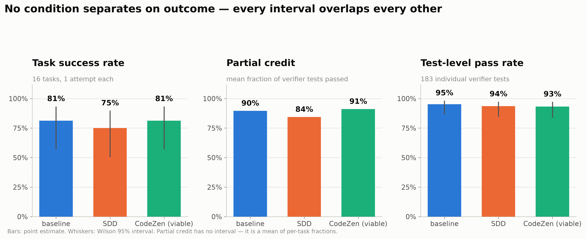

Three measurements of the same 48 trials, from coarsest to finest:

| Condition | Tasks passed | Success rate | Partial credit | Test-level pass rate |
|---|---:|---:|---:|---:|
| `baseline` | 13 / 16 | 81.2 % | 0.896 | 95.2 % (62 tests) |
| `sdd` | 12 / 16 | 75.0 % | 0.844 | 93.5 % (62 tests) |
| `codezen-viable` | 13 / 16 | 81.2 % | 0.911 | 93.2 % (59 tests) |

The three measurements agree, which is the useful part. Partial credit and test-level pass
rate are computed from the verifier's own per-test results (`verifier/ctrf.json`) rather
than from the binary reward, so they are a genuinely finer instrument — 183 graded test
outcomes instead of 48 binary ones — and they still show nothing. If a methodology effect
existed and the binary reward were merely too coarse to see it, partial credit is where it
would appear first. It does not appear.

The Wilson intervals are wide enough to contain each other completely: at n = 16 the
interval on 81 % runs from 57 % to 93 %. A difference of one task moves the point estimate
by 6.25 points, which is well inside that interval.

### Paired tests

Every task ran in every condition, so the correct tests are exact McNemar on the binary
outcome and Wilcoxon signed-rank on the continuous quantities.

| Comparison | Discordant pairs | Exact McNemar p |
|---|---:|---:|
| baseline vs SDD | 3 | 1.000 |
| baseline vs CodeZen | 2 | 1.000 |
| SDD vs CodeZen | 5 | 1.000 |

Of the seven paired continuous comparisons, exactly one clears p < 0.05: CodeZen takes
more agent steps than baseline (median Δ +4.5 steps, p = 0.023). Cost points the same way
without reaching significance (CodeZen p = 0.14, SDD p = 0.98), which is what a real but
noisy effect looks like at this sample size.

**Interpretation.** On this task set, with this agent, at one attempt per cell, neither
methodology changed the outcome. That is a null result about *this design*, not evidence
that methodology does not work — §2 is the reason the distinction matters.

---

## 2. Could this design have measured anything?

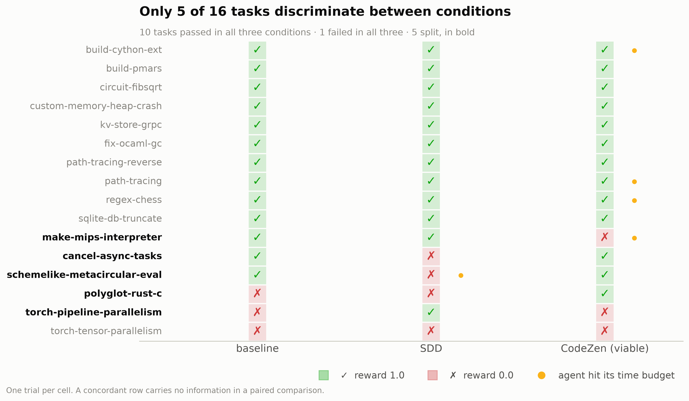

A paired comparison learns nothing from a task that both conditions pass or both fail;
those pairs are concordant and drop out of McNemar by construction. Reading the matrix:

- **10 tasks passed in all three conditions.** `build-cython-ext`, `build-pmars`,
  `circuit-fibsqrt`, `custom-memory-heap-crash`, `kv-store-grpc`, `fix-ocaml-gc`,
  `path-tracing`, `path-tracing-reverse`, `regex-chess`, `sqlite-db-truncate`.
- **1 task failed in all three.** `torch-tensor-parallelism`.
- **5 tasks split.** `cancel-async-tasks` (SDD alone fails), `make-mips-interpreter`
  (CodeZen alone fails), `polyglot-rust-c` (CodeZen alone passes), `schemelike-metacircular-eval`
  (SDD alone fails), `torch-pipeline-parallelism` (SDD alone passes).

So 11 of 16 tasks — and 60 % of the $75.49 spent ($45.23) — bought no information about the
comparison. The effective sample size per pairwise comparison is 2 to 5, not 16.

This is a **ceiling effect**, and it is the single most important fact about the run. The
task set was selected in `config/tasks-programming.txt` for complexity — hard difficulty,
long expert-time estimates — on the reasonable assumption that hard tasks discriminate.
They did not, because the agent solves most of them unaided. Difficulty for a human expert
(the metadata the selection used) turns out to be a poor proxy for difficulty for this
agent.

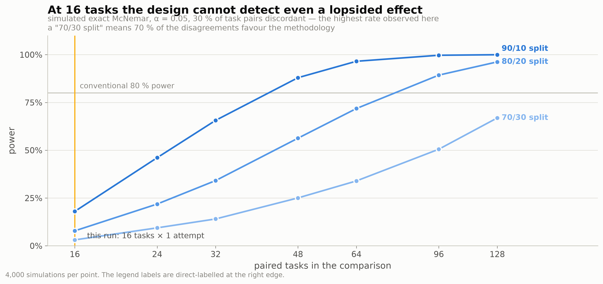

Simulating the exact McNemar test at the discordance rate actually observed (30 % of task
pairs, the highest of the three pairwise rates, so the estimate is generous):

| True effect | Power at 16 tasks | Tasks needed for 80 % power |
|---|---:|---:|
| 90 % of disagreements favour the methodology | 18 % | 48 |
| 80 / 20 | 8 % | 96 |
| 70 / 30 | 3 % | 192 |

**Interpretation.** Even a lopsided effect — nine of ten disagreements going the
methodology's way — would have been missed four times out of five. The null in §1 is
therefore uninformative about the hypothesis: the experiment was not able to reject it. The
fix is not more attempts on these tasks; it is a task set whose members the bare agent does
*not* already pass.

---

## 3. What the methodology reliably does cost

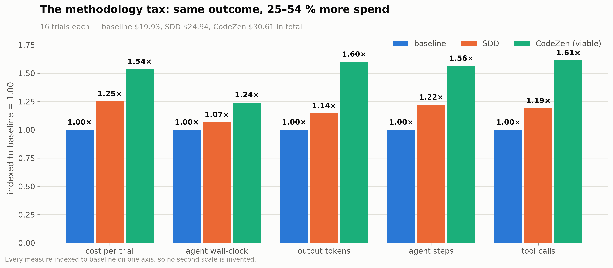

Cost is a continuous per-trial quantity rather than a rare binary event, so it is measurable
at n = 16 where the outcome is not.

| Measure | baseline | SDD | CodeZen |
|---|---:|---:|---:|
| Total spend, 16 trials | $19.93 | $24.94 (1.25×) | $30.61 (1.54×) |
| Agent wall-clock, mean | 801 s | 854 s (1.07×) | 994 s (1.24×) |
| Output tokens, mean | 51.1 k | 58.5 k (1.14×) | 81.8 k (1.60×) |
| Agent steps, mean | 27.8 | 33.9 (1.22×) | 43.4 (1.56×) |
| Tool calls, mean | 28.7 | 34.1 (1.19×) | 46.2 (1.61×) |

Cache behaviour is identical across conditions (95 % cache hit ratio, thinking tokens at
66–68 % of output in all three), so the extra spend is extra work, not a caching artefact.

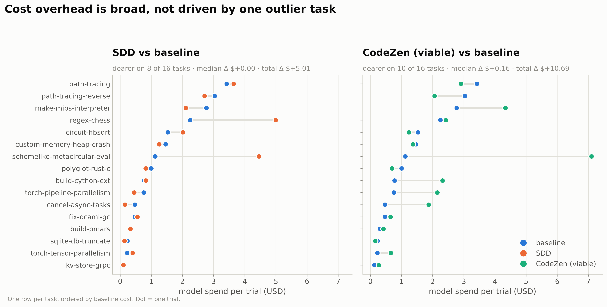

The paired view answers the obvious objection — that one runaway task inflated a mean.
SDD is dearer on 8 of 16 tasks (median Δ $0.00, total Δ +$5.01); CodeZen on 10 of 16
(median Δ +$0.16, total Δ +$10.69). CodeZen's overhead is broad. SDD's is concentrated:
its median task costs the same as baseline, and the total is carried by
`schemelike-metacircular-eval` (+$3.3) and `regex-chess` (+$2.8), both of which are the
long-horizon tasks where SDD's process actually engaged.

**Interpretation.** The methodology tax is real and, for CodeZen, consistent across the
set. Read together with §1: at the observed effect size, both toolkits are paying 25–54 %
more for the same result. That is a defensible finding *for this task population* and it
is the only comparative claim in this run with a mechanism behind it.

---

## 4. How methodology can actively hurt: the budget wall

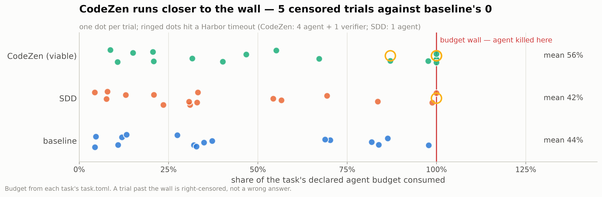

Each task declares an agent time budget in its `task.toml`; Harbor kills the agent there
and grades whatever is on disk. So the relevant quantity is not absolute duration but the
share of the declared budget consumed.

| Condition | Mean budget consumed | Trials over 75 % | Agent timeouts | Verifier timeouts |
|---|---:|---:|---:|---:|
| `baseline` | 44 % | 4 | 0 | 0 |
| `sdd` | 42 % | 3 | 1 | 0 |
| `codezen-viable` | 56 % | 6 | 4 | 1 |

Five CodeZen trials and one SDD trial were terminated by a timeout, against none for
baseline. Three of them still scored 1.0 — `build-cython-ext`, `path-tracing` and
`regex-chess`, where the agent had finished the work before it was killed. But
`make-mips-interpreter` (CodeZen) and `schemelike-metacircular-eval` (SDD) scored 0 having
run out of clock, and both are among the five discriminating tasks. In
other words, **two of the five informative outcomes in this run were decided by the budget
rather than by capability.**

A timeout is right-censoring, not a wrong answer. Folding it into a success rate silently
converts "we stopped watching" into "it failed", and it biases against exactly the
conditions that add process. This is a reporting change worth making before the next run:
report censored trials separately, and where possible grade the workdir at the moment of
the kill.

**Interpretation.** The causal path by which a methodology can lose on this benchmark is
visible: extra planning and review consume budget headroom, and on budget-bound tasks that
headroom is the margin. It is a property of the benchmark's fixed budgets as much as of the
methodology, and it should be stated as such.

---

## 5. What the agent actually did differently

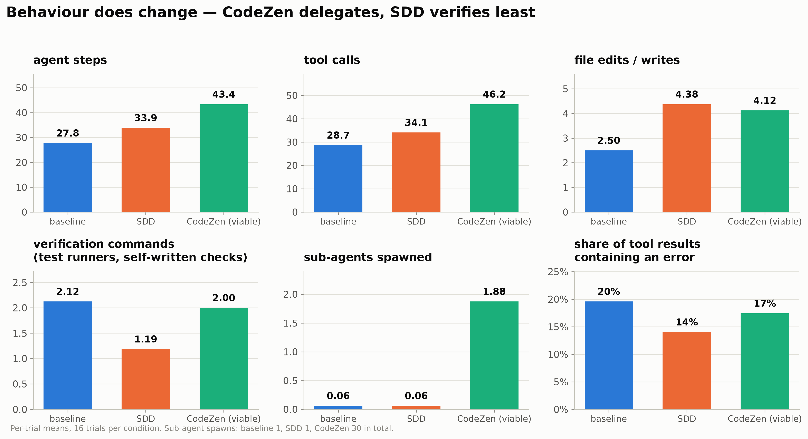

| Per-trial mean | baseline | SDD | CodeZen |
|---|---:|---:|---:|
| Agent steps | 27.8 | 33.9 | 43.4 |
| Tool calls | 28.7 | 34.1 | 46.2 |
| File edits / writes | 2.50 | 4.38 | 4.12 |
| Verification commands | 2.12 | 1.19 | 2.00 |
| Sub-agents spawned | 0.06 | 0.06 | 1.88 |
| Tool results containing an error | 20 % | 14 % | 17 % |

Two observations stand out.

**CodeZen delegates.** 30 sub-agent spawns across its 16 trials against 1 each for baseline
and SDD. This is the toolkit's actual behavioural signature — `noc-tdd` and `code-review`
both fan work out to sub-agents — and it explains most of the step and token overhead in
§3. It is also invisible to the aggregated report, which has no delegation column.

**SDD verifies less than baseline.** 1.19 verification commands per trial against
baseline's 2.12, and 0 self-written test files against baseline's 2 and CodeZen's 4. For a
specification-driven method that ships an `sdd-verify` skill, this is a counter-signal
worth taking seriously. The honest caveat: shell commands are bucketed by pattern, not
parsed. The bucket catches test runners and self-written `test_x.c` / `verify_y.py`
scripts, but misses verification done inline in a heredoc — so read it as a comparison
between conditions on one corpus, not as an absolute count.

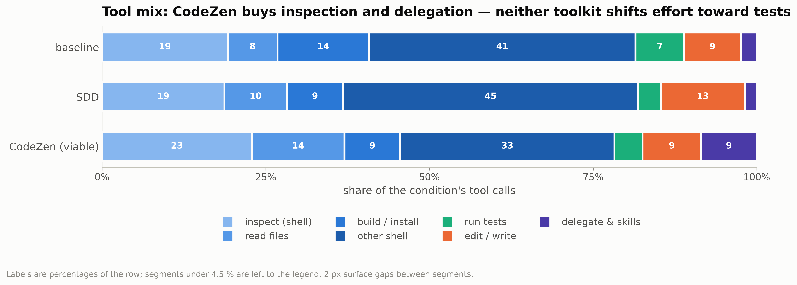

As a share of tool calls: CodeZen shifts effort into inspection (22.8 % vs 19.2 %), file
reading (14.2 % vs 7.6 %) and delegation (8.5 % vs 2.4 %), and away from raw shell work
(32.7 % vs 40.7 %). SDD shifts into editing (12.8 % vs 8.7 %). Neither shifts effort toward
tests — the test share is *highest* in baseline (7.4 %, against SDD 3.5 % and CodeZen
4.3 %).

**Interpretation.** The toolkits do change agent behaviour, measurably and in the direction
their documentation describes — more reading, more planning, more delegation. What the run
does not show is that any of it converts into outcome on this task population.

---

## 6. Adherence, corrected

> **Status.** The correction described here has since been applied to
> `scripts/report.py` on this branch, and `results/prog16_report.md` and
> `results/probe3_report.md` were regenerated from the same job output. The
> numbers below are the corrected ones; only the adherence columns changed.

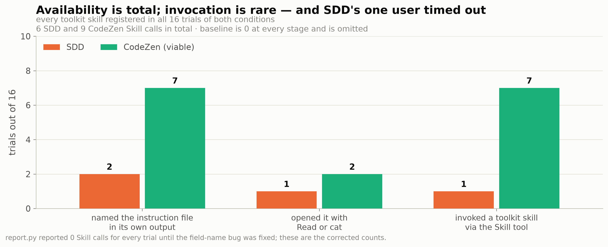

`scripts/report.py` reported `Skill Tool Calls = 0` for all 48 trials. That was a bug, not a
finding: the counter looks for the substring `"name": "Skill"` while the ATIF trajectory
names the field `function_name`, so it can never fire. Reading `function_name` off the tool
calls finds **15 real `Skill` invocations** — 9 CodeZen, 6 SDD.

The same section's "Skills Invoked" column errs the other way: it substring-matches skill
names anywhere in agent-authored trajectory text, so an agent that lists its skills
directory scores as having used every skill it owns. That is why the report shows CodeZen
"using" all four skills on trials whose strict count is one.

Under the strict definition — a `Skill` tool call whose skill name is one the variant
installed — out of 16 trials each:

| | SDD | CodeZen |
|---|---:|---:|
| Named `CLAUDE.md` / `AGENTS.md` in its own output | 2 | 7 |
| Opened an instruction file with `Read` or `cat` | 1 | 2 |
| Invoked a toolkit skill | 1 | 7 |
| Toolkit `Skill` calls in total | 6 | 9 |

Every toolkit skill registered in every one of the 32 toolkit trials, and preflight proves
the instruction files were present. So availability was total and invocation was rare. Note
that "opened an instruction file" is a weak proxy for Claude Code specifically: it loads a
project `CLAUDE.md` silently into its system prompt, so an agent has no reason to open the
file it has already been given.

The eight skill-using trials:

| Task | Condition | Skills invoked | Outcome |
|---|---|---|---|
| `build-cython-ext` | CodeZen | `code-review` | pass (agent timeout after finishing) |
| `cancel-async-tasks` | CodeZen | `code-review`, `noc-tdd` | pass |
| `kv-store-grpc` | CodeZen | `noc-tdd` | pass |
| `make-mips-interpreter` | CodeZen | `code-review` | **fail** (agent timeout) |
| `schemelike-metacircular-eval` | CodeZen | `code-review`, `security-review` | pass |
| `torch-pipeline-parallelism` | CodeZen | `code-review` | **fail** (verifier timeout) |
| `torch-tensor-parallelism` | CodeZen | `noc-tdd` | **fail** |
| `schemelike-metacircular-eval` | SDD | `sdd-specify`, `sdd-tasks`, `sdd-plan`, `sdd-analyze`, `sdd-clarify`, `sdd-implement` | **fail** (agent timeout at 2,400 s) |

The pattern in CodeZen is that `code-review` and `security-review` are invoked *after* the
work — a review pass rather than a method for doing it. `noc-tdd` is the only skill that
drives implementation, used three times. SDD's single skill-invoking trial ran nearly the
whole chain and then hit the wall.

**Interpretation.** This is the finding with the widest consequences, because it questions
what the experiment measured at all. If a methodology is invoked in 1 of 16 trials, the
comparison is not "method versus no method" but "a repository containing a method, mostly
unused, versus a bare task". Whether that is a fact about the toolkits (they gate
themselves on task size), about the benchmark (a bare Harbor prompt gives no reason to
consult a process), or about the agent, this run cannot separate — and it is the question
worth resolving before spending more.

---

## 7. Where the time goes inside a trial

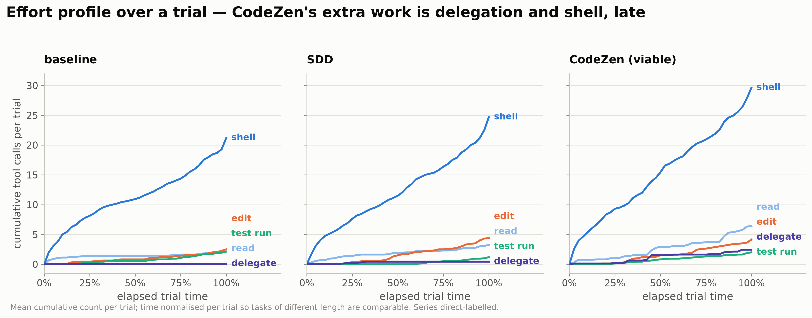

Mean cumulative tool calls against elapsed trial time, normalised per trial so tasks of
different length are comparable. Baseline and SDD have the same shape: shell work
accumulates steadily from the start, everything else stays flat. CodeZen's profile differs
in two ways — a visibly heavier read phase in the first quarter, and a delegation curve
that only starts rising after roughly 25 % of the trial and keeps rising to the end.

**Interpretation.** The shape matches what the two methodologies claim to do — front-load
understanding, then fan work out — and it locates the extra spend from §3 in time as well
as in kind. It also shows why CodeZen presses against the budget wall (§4): its added work
is not a fixed setup cost that finishes early, it accumulates through the whole trial.

---

## 8. Cost-effectiveness

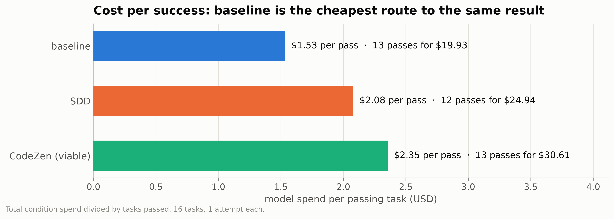

| Condition | Passes | Spend | Spend per pass |
|---|---:|---:|---:|
| `baseline` | 13 | $19.93 | $1.53 |
| `sdd` | 12 | $24.94 | $2.08 |
| `codezen-viable` | 13 | $30.61 | $2.35 |

With success rates equal, the marginal cost per *additional* success is undefined (SDD) or
negative, so cost per success achieved is the only honest framing. Baseline is 27 % cheaper
per pass than SDD and 35 % cheaper than CodeZen.

**Interpretation.** For an operator choosing a configuration for tasks that look like this
set, the run says: pay less, get the same. That conclusion is bounded tightly by the
ceiling effect in §2 — most of these tasks did not need a method — and does not transfer to
task populations where the bare agent fails more often.

---

## 9. What this run supports, and what it does not

**Supported.**

1. The pipeline works end to end at 16-task scale, with no payload collisions and no build
   failures. 47 of 48 trials produced a reward; the 48th
   (`torch-pipeline-parallelism`/CodeZen) lost its verifier to a timeout, so it has neither
   a reward nor per-test detail and is counted as a non-success throughout.
2. Methodology costs 25 % (SDD) and 54 % (CodeZen) more than baseline for the same measured
   outcome; CodeZen also takes 1.24× the wall-clock and 1.56× the steps, the latter being
   the only paired comparison significant at p < 0.05.
3. Methodology consumes budget headroom and raises censoring risk: 5 CodeZen and 1 SDD
   trials hit a Harbor timeout against 0 for baseline, and two of the five informative
   outcomes were decided by the clock.
4. Availability is not adherence. All toolkit skills registered in all 32 toolkit trials; a
   toolkit skill was invoked in 8, mostly as a post-hoc review pass.
5. The toolkits change behaviour in the direction they advertise — more reading, more
   planning, more delegation — without changing outcome here.

**Not supported.**

1. Any claim about which methodology produces better outcomes. 11 of 16 tasks are
   concordant, no pairwise McNemar approaches significance, and simulated power is under
   20 % even for a lopsided effect.
2. Any claim about variance, flakiness or stability: one attempt per cell means no
   replicate exists.
3. Any claim about `codezen-full` versus `codezen-viable` — only the 3-task probe ran the
   full condition.
4. Any claim that generalises past this task population. The set was chosen for
   human-expert difficulty, and the agent passes 10 of 16 unaided in every condition.

**Confounds carried forward, unchanged by this run.**

- **Payload breadth.** Toolkits are deployed in full, so `docs/`, `tools/`, `kits/`,
  `standards/` land in the agent's working directory alongside the task. The condition
  under test is "a repository configured with this toolkit", not "the methodology text".
- **`codezen-viable` is a curated subset.** Seven CodeZen skills cannot run in a benchmark
  container (they need a Docker daemon, a human, a system under test, or the Notion MCP
  server), so the comparison is SDD-as-shipped against a four-skill CodeZen.
- **Adherence instrumentation is textual.** It cannot see a `CLAUDE.md` that the CLI loads
  silently, and until the `Skill`-counter bug is fixed the report understates invocation to
  zero.

---

## 10. What to change before the next run

Cheapest first; the first four cost nothing and one of them *reduces* spend.

| Change | Why |
|---|---|
| Report partial credit and test-level pass rate as headline metrics | ~4× the graded outcomes from the same trials, and they already agree with the binary reward, so the upgrade is free |
| ~~Fix `parse_adherence` in `scripts/report.py`~~ — **done 2026-08-28** | `skill_tool_calls` read the wrong field name and `skills_invoked` matched too loosely, so both columns were wrong in opposite directions. The reporter now requires a `Skill` tool call naming an installed skill and reports the loose match separately; both reports were regenerated and no other number moved |
| Report timeouts as censored rather than failed | Two of five informative outcomes here were clock, not capability |
| Drop or replace the 10 all-pass tasks | They consumed 60 % of the spend and carried no information. Keep two as a floor check |
| Re-run the verifier on the final state of `torch-tensor-parallelism` and `torch-pipeline-parallelism` | Separates a flaky or over-strict verifier from a real failure; costs no model tokens |
| Screen candidate tasks with the `nop` and `oracle` agents, and with one baseline trial, before including them | Turns the ceiling effect into an inclusion criterion rather than a post-hoc discovery. A task the bare agent already passes cannot discriminate |
| Raise `--attempts` to 3 on a smaller, discriminating set | Buys replicates and variance estimates for roughly the same total spend |
| Add instruction-compliance and time-to-first-passing-test | Measures whether the method was *followed*, and gives a speed metric that survives a ceiling |

The full metric catalogue — what `report.py` reports, the 19 metrics derived in the
notebook from data already on disk, and 11 candidates worth instrumenting — is section 9 of
[`prog16_analysis.ipynb`](prog16_analysis.ipynb).

---

## 11. Open questions that would sharpen the interpretation

These are questions about the experiment's intent, not about its data. Each one changes how
the same numbers should be read.

1. **What decision does this measurement feed?** Choosing an internal default
   configuration, publishing a methodology comparison, or validating that a toolkit ships
   value are three different bars. The cost finding in §3 is decision-grade for the first
   and nowhere near publication-grade for the second.
2. **Which endpoint is primary — outcome, cost, or conformance?** If cost-at-equal-outcome
   is the endpoint, this run already answers it for this population. If outcome is the
   endpoint, §2 says the design has to change before any answer exists.
3. **Should a timeout count as a failure?** Treating the declared budget as part of the
   task is defensible (a method that cannot finish in budget has lost); so is treating it
   as censoring. The choice moves two of five informative outcomes.
4. **Is the target population autonomous single-shot benchmark tasks, or real repository
   work?** Methodologies are written for multi-session work with a human in the loop and
   ambiguous requirements. Terminal-Bench tasks are self-contained and fully specified,
   which is precisely the regime where a specification process has least to add.
5. **Is low adherence a finding about the toolkit or an artefact of the harness?** If the
   experiment should measure the method *as practised*, the prompt may need to instruct the
   agent to follow the repository's process, which changes the condition from "method
   available" to "method mandated" and needs stating.
6. **Should the comparison be equal-task or equal-budget?** Giving baseline the same spend
   or wall-clock as the methodology conditions (more attempts, or best-of-n) would test
   whether the overhead buys anything that simply trying again does not.
7. **Which toolkits are the subject and which is the control?** If one of them is the one
   being developed, the interesting question is a within-toolkit before/after against a
   fixed baseline, not a head-to-head — and §2's power problem is much cheaper to solve in
   that framing.
